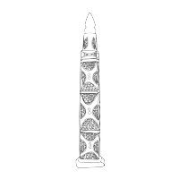
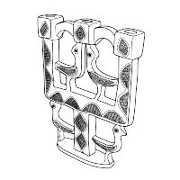
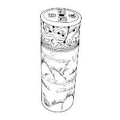
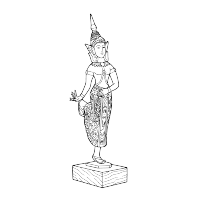
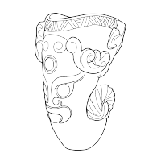
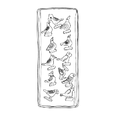
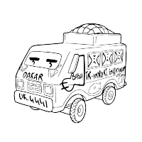
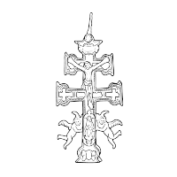
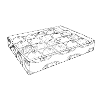
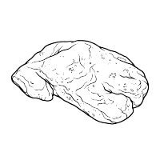

# Chiriandreses Museum — Project Report

*An end-to-end record of a personal 3D-digitisation project: planning, capture, processing, and publication. Compiled from the Chiriandreses Museum website — every section below reflects what is published on the site, brought together into a single document.*

Author: Eva Perez Chirinos — Digital Cultural Heritage, Photogrammetry, 3D and Digital Asset Management.
[LinkedIn](https://www.linkedin.com/in/eva-perez-chirinos) · [GitHub](https://github.com/evapchiri)

Content licensed [CC BY-NC-SA 4.0](https://creativecommons.org/licenses/by-nc-sa/4.0/).

---

## Contents

1. [What is Chiriandreses Museum?](#1-what-is-chiriandreses-museum)
2. [About the author](#2-about-the-author)
3. [Project lifecycle — overview](#3-project-lifecycle--overview)
4. [Stage-by-stage](#4-stage-by-stage)
5. [Object catalogue](#5-object-catalogue)

---

## 1. What is Chiriandreses Museum?

> "An object in a museum is a condensed story, a silent witness waiting for a listener."
> — Sandra Dudley, *Museum Materialities: Objects, Sense and Feeling* (2009)

**Chiriandreses Museum** is the culmination of a personal, end-to-end 3D digitisation project of my family's heirlooms and travel mementos — it is a portal where you can see and interact with their 3D models, explore their digitisation notes, and learn about my family's stories encapsulated in them.

My parents have a vitrine in their living room filled with travel objects and treasures — these hold the stories of their romance, of how our family came to be. I love hearing what's behind each piece, and every time I look into this vitrine again, a new object appears — a new story to hear.

But these stories only live in their heads — and one day they won't be here to share them. So I decided to **record** them, so I can listen to them for years to come, and pass them on to my own family one day.

### So how did I do it?

Using photogrammetry techniques, **every object was digitised as if they were a museum object** — aiming for **high-quality models**, **best model-object fidelity** given the available hardware and my current skills, and to achieve a high-end degree of **traceability**.

To achieve these targets, I have:

- Followed the guidance offered by the [3D4CH centre](https://www.3d4ch-competencecentre.eu/en/) on how to produce high-quality 3D digitisation models for Cultural Heritage, along with some tips from photogrammetry professionals in the field from different community forums.
- Implemented the European Commission's [VIGIE 2020/654 framework](https://digital-strategy.ec.europa.eu/en/library/study-quality-3d-digitisation-tangible-cultural-heritage) to learn-while-doing the current best practices on paradata and metadata for the Cultural sector.

The result is a 7-month, 6-stage thoroughly documented digitisation project spanning from photography, to metadata gathering, processing of 3D models and, finally, sharing them into a curated digital platform.

It's an honest, personal record of what was truly measured or estimated, some playful experiments, and a journal of models that never came to be, and why.

### A technical and a personal record

The project can also be read from two angles — the technical record (the Project lifecycle and Stage-by-stage sections below, both reproduced in full in this report), and the personal record of how it was made (only available in the website, as 'Lab journal' and 'Lessons learned' sections). The Lab journal is a day-by-day account of the challenges faced, how I tried to tackle them (and sometimes failed), and what I learned along the way; Lessons learned captures the biggest takeaways from it.

---

## 2. About the author

Long story short: **I'm an archaeologist in love with all things digital** — diving into how 3D interactive data can offer new ways of experiencing, studying and preserving cultural heritage in the digital space.

During my BA in Archaeology and Anthropology at UCL, I found myself very early on gravitating towards **Digital Humanities**. My very first true hands-on experience with 3D and digitisation techniques was during this time, when I was a post-ex supervisor overseeing the finds processing pipeline of a student-led excavation.

While I was structuring the excavation's database, I realised that I didn't want all these great pieces of information to just stay as rows in a database. So I decided to implement a **new photographic workflow** using artefact photography, photogrammetry and RTI for the 2D and 3D visual documentation of our most relevant artefacts and trenches. This way I could enable them to be interacted with outside of the dig, facilitating possible further specialist analysis, or their display in classrooms and local exhibitions. This experience sparked in me **a deep intrigue for the potential of advanced imagery to enhance accessibility, dissemination and research in Cultural Heritage**.

This excavation's digitisation work earned me the 'Peter Dorell Prize' 2022 from the Institute of Archaeology, and some of my artefact photographs were later displayed at a temporary exhibition in the Weald & Downland Living Museum in 2023.

Managing media and data across this excavation and other Digital Archaeology projects taught me how to successfully navigate the real-world struggles of generating digital media within tight budgets, timelines, and not the most "cushy" environments. I experienced the importance of **traceability** in Heritage (but how easy it is to lose sight of it too) and equally so, to pay attention to the **labelling and organisation of that generated media** so that its reuse does not become a derived struggle afterwards. That's when **software, documentation and digital asset management** became just as much of a passion for me as Cultural Heritage itself.

**I decided to stop being just a 'user' of software and really get to understand how it gets built.** After a deep dive in software programming and Cloud architecture, I spent the last couple of years working in SaaS software technical support, learning first-hand how web apps get deployed and iterated on in the real world, and how digital experiences get curated. I got pretty good at helping both internal and client teams do their best work when problems arose, eventually supporting the documentation and development of a Digital Asset Management cloud platform.

Ultimately, **Chiriandreses Museum is where all of that technical and archaeological knowledge merges**. An end-to-end digitisation pipeline that spans from initial project planning and field photography to data processing, culminating in that key final step: sharing the stories behind the geometric data through a curated, interactive platform.

### Other relevant experience

- **CodeFirstGirls alumni:** 'CFGDegree' in Software & Data Engineering (*Merit*) & '+Masters' in DevOps & Cloud (*Distinction*). — Back-end and front-end programming skills, Cloud software architecture knowledge, and UX/UI notions.
- **Europeana's Digital Storytelling Resident 2026** — Produced a video exploring the existential dread caused by the loss of authenticity in the age of AI. Designed and developed under the mentorship of Europeana professionals on storytelling techniques to reuse digital cultural heritage.
- **Contributed to the University of Oxford's "MarEA Project"** — Researching cyclonic impacts on Omani maritime heritage. Work [published on the project's website](https://marea.soton.ac.uk/2021/10/26/examining-omans-cyclonic-activity-and-its-impact-on-maritime-cultural-heritage-student-project/).
- **Assistant to "Monumentality and Landscape: Linear Earthworks in Britain"** (UCL Institute of Archaeology & Durham University, Leverhulme Trust-funded) — Database development and grey literature retrieval.

### Awards & recognition

- **2022 Peter Dorell Prize** (UCL Institute of Archaeology) — For the "high quality" of the photographic dataset produced, including 3D photogrammetry and RTI models, which enhanced the accessibility of key excavation artefacts for further specialist research.
- **Avalara "Customer Champion" award**, Q1 2025 — For "unwavering commitment to putting customers first. With nearly 90% of Avalara Europe's glowing Trustpilot reviews and continues to set the gold standard for CSAT across the team."
- **'Highly commended candidate' award x2** — For work on the group final projects of two CodeFirstGirls Kickstarter short-courses: Python & Apps | JavaScript.

---

## 3. Project lifecycle — overview

An overview of the six stages that involved turning a family object into a digital story:

| Stage | Title | Summary |
|---|---|---|
| 01 | **Project planning** | Project morphology designed to follow the EC's VIGIE 2020/654 study framework and 3D4CH guidelines for 3D digitisation projects in Cultural Heritage. Drew out timelines, requirements, and individual object complexity prior to the start of photography. |
| 02 | **Photography** | Turntable photogrammetry capture — 18 objects photographed within 1 week of access at the end of February 2026. Both experimental and result-driven approaches were used. |
| 03 | **Photogrammetry processing** | Using Agisoft Metashape: tie points, point cloud, mesh and texture reconstruction, implementing AI-masking workflows. Developed 'HeritageScan' (custom RealityKit CLI) as an experimental second algorithm where the standard pipeline failed. |
| 04 | **Post-processing** | Blender: retopology, UV unwrap, normal/AO bakes, mesh cleanup. Roughness and metallic maps are authored here — measured where possible, judged by eye where not, and flagged as such. |
| 05 | **Metadata & paradata** | Gathering and organising records. One merged source of truth per object: family metadata and captured digitisation-process paradata (equipment, angles, image counts, Metashape calculations & deliverables). Pinning down every value that was graded, and what was estimated. |
| 06 | **The website** | Ten finished models on Sketchfab, embedded in a purpose-built site with the full provenance record beside each one. Released under CC BY-NC-SA 4.0. |

---

## 4. Stage-by-stage

A closer walkthrough of what happened at each stage of the digitisation pipeline.

### Stage 01 — Project planning

**The project holds three main aims**:

- To generate 'museum-aligned', high-quality 3D models of my family heirlooms and travel objects collection, given the available hardware and my current skills. That meant aiming for optimal geometric data, best possible model-object fidelity, and high degree of traceability.
- Following digital storytelling techniques, make these 3D models publicly accessible through a curated, interactive and user-friendly web experience.
- To deepen and specialise my 3D digitisation skills for the Museum space, by applying the most up-to-date professional standards required in Cultural Heritage.

The project was divided into two strands:

- **CM-D001 — Digitisation campaigns:** Generating 3D models of the objects using photogrammetry.
- **CM-W001 — Webapp:** Design & development of a digital platform to allow interaction with the generated 3D models and their data.

These strands were designed to be both reiterated if needed (re-capturing objects that didn't work the first time) and expanded (e.g. CM-D002, etc.) as I do more digitisation rounds in the future, or roll out new versions of the website.

*As of the end of CM-D001, the successfully digitised bunch (10 objects) is roughly only 1/6 of my parents' 60+ full collection.*

Because of the pragmatic learning nature of this project and ever-expanding aim, there were a handful of objects that were also photographed purely as experiments, with no expectation of generating usable models in this first instance.

**The project's documentation framework** (deciding what and how things should be documented) was designed for a solo practitioner, following:

- Best-practice standards set by the European Commission for best-quality digitisation processes in Cultural Heritage (the [VIGIE 2020/654 study](https://digital-strategy.ec.europa.eu/en/library/study-quality-3d-digitisation-tangible-cultural-heritage)), which heavily focus on high traceability.
- The professional guidance provided by the 3D4CH Competence Centre — in particular its *Essential Guide to 3D Digitised Heritage* training series, and the "Capturing and Processing 3D Data" session presented by Catherine Anne Cassidy of CARARE.

Each object was assessed individually at this stage for capture complexity — considering how difficult the processing might be depending on its shape, surface, and materials. That assessment influenced both the object's capture approach and its minimum "what good looks like" 3D model targets.

Likewise, the lack of professional-grade photographic equipment, evolving photography and 3D modelling skills on the go, and narrow, non-repeatable access to the objects (under 2 weeks) all influenced these quality targets and completion deadlines.

### Stage 02 — Photography

A total of 18 objects were photographed over a single week of access at my parents' home in Spain (16–22 February 2026), immediately before I moved to Japan. That means the objects were not reachable for a re-shoot during the rest of the project — so whatever the photographs captured (or missed) is what I had to work with at every later stage.

As this was carried out without access to professional imaging equipment, some standard calibration tools were absent or substituted with practical alternatives: a hand-measured cardboard scale in place of a calibrated one, and no colour calibration chart at all. This means colour accuracy and precise measurements shouldn't be treated as lab-grade, though they're adequate for the exploratory purposes of this project.

**The equipment** (maintained through the capture stage of CM-D001):

- **Camera:** Canon 2000D DSLR, EF-S 18–55mm IS II lens
- **Lighting:** 2× NEEWER dimmable LED panels, 5600K, with a white diffuser
- **Scale reference:** hand-measured cardboard scale, accurate to ±1mm
- **Colour calibration chart:** none available — white balance done manually
- **Set-up:** 30cm wide manual turntable
- **Background:** two A4 80gsm papers covering the turntable, and white rubbercloth behind

**The capture process:** the turntable was turned by hand in roughly 10–15° steps, taking around 15–20 minutes of shooting per object. Objects were generally shot in 3–4 rings, top to bottom: "Half-Top" (~70°), "Front" (~0°), "Half-Bottom" (~−10°), and "Bottom" (~45°, when the underside was captured).

Six objects were deliberate experimental capture subjects, with no expectation of generating usable models:

- CHAN-005 "House models" — chosen to test high colour reflectivity.
- CHAN-008 "Kumkum powder box" and CHAN-010 "Silver quill" — chosen to test generating a model that could later be animated opening and closing.
- CHAN-011 "Ornamental carving of African scenes" — captured handheld, to experiment with different set-up approaches.
- CHAN-014 "Caravaca cross" and CHAN-015 "Dual-scale mercury thermometer" — chosen to experiment with very reflective, almost mirror-like, metallic surfaces.

*None of the above objects resulted in a successfully processed model at the time — CHAN-014 was later rescued in September (see the Lab journal on the website).*

**An important, skill-focused afternote:** I went into the photography stage with a working but non-specialist grasp of photogrammetry and photography. Some techniques and 'must-haves' that I now, at the end of the project, consider essential were simply not on my radar at the time. As a result, no cross-polarisation was used — a technique critical for reflective or shiny surfaces — and some objects lacked full ring coverage, meaning a few more angles should have been captured to avoid possible camera misalignment. These gaps in technique are the reason some of this set's geometry and textures needed manual tweaking during post-processing.

### Stage 03 — Photogrammetry processing

This is where the week's photographs became 3D models. Two processing tools were used and tested:

- **Agisoft Metashape (Standard version)** — the standard, first-instance photogrammetry processing tool.
- **HeritageScan** — a custom CLI tool, developed by my partner and software engineer Robert Upson on Apple's RealityKit, to try a different reconstruction algorithm against the same source images where Metashape failed.

A basic photogrammetry pipeline involves, in order: preparing the images to optimise alignment (exposure + masking) → aligning images to build a tie-point (sparse) cloud → refining this cloud by removing low-confidence points → reconstructing the geometric mesh → reconstructing the texture maps (albedo, normal, and ambient occlusion).

Much of this stage was experimenting and learning what each setting actually does, and which ones matter for which kind of object — the processing workflow kept evolving as challenges came up and got solved. The biggest workflow improvement was introducing an AI-assisted automatic masking step (built into Metashape) right at the start of the pipeline, instead of generating masks from an already-built model to refine alignment after the fact. This, together with other tidied-up steps, brought a model's processing time down from about 1.5 hours to roughly 40 minutes (compute time included), and improved final mesh quality.

However, not everything cooperated, and a few "fiascos" happened too, particularly on very shiny objects and unreferenced, feature-less objects. Metashape struggled to align chunks on some objects (CHAN-004, CHAN-005, CHAN-008, CHAN-010), and failed to align them completely on others (CHAN-002, CHAN-011, CHAN-014, CHAN-015) — down to inherently difficult textures, lack of ring coverage, or lack of scene references to aid alignment.

HeritageScan didn't rescue most of Metashape's failed alignments, but succeeded with particular objects. With CHAN-013 (Senegalese bus), it reconstructed the model faster and more cleanly than the standard Metashape pipeline. With CHAN-004a (Akua'ba wooden fertility doll — Female), it aligned perfectly compared to Metashape, but the geometry was still incorrect and the textures were poor quality. The lesson: a different algorithm can't make up for data the camera never recorded — getting the capture right, or at least capturing enough data to experiment with, is crucial.

**Digitisation results table** (all 18 photographed objects):

| Object | Metashape | HeritageScan | Final set |
|---|---|---|---|
| CHAN-001 — Marrakech's Koutoubia replica souvenir | Success — great model, barely any issues | Success — great, though texture generation weaker than Metashape's | Yes |
| CHAN-002 — Bijagós totemic figure | Failed — alignment failed from the start, poor masking | Failed — bottom alignment incorrect | No |
| CHAN-003 — Berber candlestick | Success — small unrecorded area (white gap), correctable in Blender | Failed — same white gap plus blobs at the bottom | Yes |
| CHAN-004a — Akua'ba wooden fertility doll (Female) | Failed — dark leg areas misread as holes; corrected surface reduced accuracy | Success — spiderwebs / bottom gunk remain, but legs even out, better overall | No |
| CHAN-004b — Akua'ba wooden fertility doll (Male) | Failed — groin gaps couldn't be resolved; abandoned | Failed — good-looking model but hip alignment incorrect | No |
| CHAN-005 — House models *(experiment)* | Failed — alignment impossible despite trying different settings | Failed — better alignment than Metashape, but still incorrect | No |
| CHAN-006 — Chinese personal seal | Success — great, minor roughness on top corner/shaft | Success — even better than Metashape | Yes |
| CHAN-007 — Thai dancer | Partial — group failed (merged parts, arm gaps); middle figure alone succeeded | Failed — cleaner group model, but textures too blurry | Partial — single figure only |
| CHAN-008 — Kumkum powder box *(experiment)* | Failed — too few bottom images; both open and closed poor | Failed — many blind spots on both | No |
| CHAN-009 — Chinese rhyton | Success — minor texture hiccup on the tail | Failed — worse textures, same tail issue | Yes |
| CHAN-010 — Silver quill *(experiment)* | Failed — top part moved during capture, flawed from the start | Failed — same underlying capture issue | No |
| CHAN-011 — Ornamental carving of African scenes *(experiment)* | Failed — poor data acquisition | Failed — not good, though reasonable given the data | No |
| CHAN-012 — Box of little birds | Success — "perfect model" | Not run | Yes |
| CHAN-013 — Senegalese toy bus | Success — good (with and without wheel holes) | Success — even better, though missing the wheel holes | Yes |
| CHAN-014 — Caravaca cross *(experiment)* | Success — originally failed; rescued by a later reprocessing pass (optimised alignment parameters and a hybrid of masked/unmasked photos) | Failed — struggled with the bottom parts | Yes |
| CHAN-015 — Dual-scale mercury thermometer *(experiment)* | Failed — best of the two; top 99% correct, but the stand's small holes were consistently covered by a white net needing heavy Blender rework | Failed — also struggled with this object | No |
| CHAN-016 — Box of stone eggs | Success — great model | Failed — unexpectedly wrong alignment | Yes |
| CHAN-017 — Mysterious stone foot | Success — great model | Failed — another unexpectedly wrong alignment | Yes |

*A model was only counted as 'successful completion' if the geometry and texture was good as-is, or only needed minor manual correction. A model that needed circumstantial mesh or texture tweaking, or albedo texture interpretation, to be considered complete would not count as 'successful'. 10 out of 18 objects met that standard.*

### Stage 04 — Post-processing

Every successfully processed model passes through Blender for any needed mesh cleanup and texture polishing — mesh repair, local smoothing, and any missed albedo texture corners.

**Mesh or texture polishing record:**

| Object | Mesh / geometry work | Texture / albedo work | Roughness / metallic map | Why it was needed |
|---|---|---|---|---|
| CHAN-003 — Berber candlestick | None | Patched — manually patched missing texture under the bird-attachment holes, clone-sampled from adjacent surface | Not created | White-feathered areas where the texture was not fully reconstructed |
| CHAN-006 — Chinese personal seal | None | None | Recreated — tweaked roughness and IOR levels | The object's material has a smooth shine that's part of its quality |
| CHAN-007 — Thai dancer | Reshaped — minor manual reshaping of the underarm geometry | None | Recreated — manually painted metallic map for the gilded areas; shine judged by eye against the object | Self-occluded joint was misread during reconstruction; focus limitations on fine extremities |
| CHAN-009 — Chinese rhyton | None | Patched — manually corrected the dragon-tail motif area, clone-sampled | Not created | Self-occlusion where the motif twists back on itself |
| CHAN-016 — Box of stone eggs | Reshaped — manual smoothing/reshaping of the eggs' surface geometry | None | Recreated — manually reconstructed roughness map across the 20 stone types, informed by memory and reference photos | No cross-polarisation used; the naturally shiny stone produced an uneven, bumpy reconstruction |
| CHAN-014 — Caravaca cross | None | None | Recreated — non-empirical roughness map hand-painted from photo references, to separate the reflective brass from the matte velvet backing | Brass surface is quite reflective; no polarised lighting used during capture |

At the start of this stage I had never opened Blender before, so best practices for 3D modelling and model-optimisation for web-sharing were completely new to me. As a result this stage took longer than expected: at the time Chiriandreses Museum V1 is published, a retopology workflow — reducing model face count and file weight, alongside a cleaner UV unwrap and re-baked normal maps — is still ongoing. The model versions currently uploaded to Sketchfab are the raw, un-optimised ("un-retopologised") 3D models — heavier and less efficient for web-sharing or VR/AR reuse than they eventually will be. *The results and behind-the-scenes details of this retopology process will be rolled into a future version of this website, alongside a visual comparison space for both "raw" and "optimised" models.*

Roughness and metallic maps (specularity maps) aren't generated during the photogrammetry process itself, but some objects in the collection show a surface shine or reflection — that comes from specularity values/maps generated at this stage using PBR shaders in Blender, through a mix of interpretation, reference photographs, and memory, rather than empirical measurement.

*This particular topic — the empirical capture and processing of an object's specularity texture maps — has sparked a deep interest in me, one born out of this project and that I'm currently researching as I prepare this website's V1 roll-out in September 2026. I'm currently carrying out digitisation experiments using the open-source, pioneering [Kintsugi 3D Builder](https://forums.culturalheritageimaging.org/topic/4790-kintsugi-3d-builder-overview/), co-developed by the University of Wisconsin–Stout, the Minneapolis Institute of Art (Mia), and Cultural Heritage Imaging (CHI), which aims to give digitisation specialists an avenue to do exactly this. The photographic workflow that this software requires will be implemented in future digitisation campaigns.*

### Stage 05 — Metadata & paradata

One of the most important things about this project was to keep an honest, detailed record of how each model came to be, to enhance traceability — a critical documentation principle drawn from the VIGIE 2020/654 study.

With the models done, their metadata (information about the object) obtained, and their paradata (information about the capture and processing of an object) records finished, these were pulled together in a single, final source of truth rather than kept in separate silos.

This stage also involved some non-technical, more administrative work: translating my parents' notes about each object from Spanish into English, writing the story behind each of these for public-facing use, and sorting the collection into categories and shared labels.

I also archived and published each successful object's Metashape processing report, holding the details of what decisions were taken during photograph alignment and geometry reconstruction, along with reprojection values calculated by the software.

Every value on the site has been marked with honesty on its provenance — measured, or estimated — so the confidence behind each number is clearly visible, rather than assumed.

### Stage 06 — 'Chiriandreses Museum' website

A 3D model on its own doesn't carry much value in Cultural Heritage. A scan without its context — where the object came from, what it meant, how it was captured, and what that capture can and can't tell you — is a shape without a story. As Dr. Marinos Ioannides put it at the Digital Heritage Summit 2026:

> "(In Digital Heritage) we create **knowledge**, not just geometric data."

This site exists to put that context back around each model.

Chiriandreses V1 has a deliberately simple tech stack to focus on an initial, quick deliverable to iterate on — HTML, CSS, and JavaScript, with no framework and no build step beyond a few small scripts. Hosting the models on a third-party site like Sketchfab is a result of this proof-of-concept focus: it keeps the repository small and leaves the 3D viewer's performance and structure to a platform designed specifically for it.

To accelerate delivery, I directed the build of this website alongside Claude Code. While the LLM helped speed up the coding, the UI, UX, structural design, and storytelling are entirely my own work. The narrative approach in particular draws on digital storytelling techniques picked up during my Europeana Digital Storytelling residency, which ran alongside this project.

All choices in the UI and user journey carry the same principle as the research behind the project: provenance is displayed as stamped labels on each record rather than hidden in a spec sheet, so the confidence behind every value is visible at a glance.

The website's data structure is also deliberately lean: JSON files rather than a SQL database, sized to fit its current and projected scope rather than built for scale it doesn't need. It skips a formal cultural-heritage ontology like CIDOC CRM — even though the provenance vocabulary running through it aims to mirror museological convention, adapting the resources to the project and scoping them appropriately takes priority. A validation check step runs at build time so every required field is confirmed present, avoiding retroactive work.

Responsiveness and accessibility were also built in: ARIA roles across every tab and panel, full keyboard support for the tab strips and image carousels, respect for reduced-motion preferences, and a layout that reflows — down to the type scale — for phone-sized screens.

Planned for later versions: a curated way of exploring the collection, and self-hosting the models instead, to experiment with different visualisation approaches.

---

## 5. Object catalogue

Ten objects, digitised under campaign **CM-D001** (16–22 February 2026 capture; processing continued through mid-2026), captured with a Canon DSLR 2000D (EF-S 18–55mm IS II lens), 2× NEEWER portable dimmable LED lights (5600K, 1000LM, white diffuser filter), sRGB colour profile, no colour target, and a homemade scale reference accurate to ±1mm — unless otherwise noted. Target tolerances across the set: accuracy ±1mm, resolution <0.8mm, reprojection error <0.8px.

Each entry below mirrors the structure and terminology of the object's own page on the site: the curated record fields, the Photogrammetry processing summary, the Texture maps panel (a fixed five-slot grid — Albedo, Normal, AO, Roughness, Metallic — resolved from the underlying provenance record, with "as-is from processing" standing in wherever a map was never touched or created), and the Full record's Assessment, Capture tolerances & equipment, Acquisition, and Processing & derived assets sections.

Provenance status follows a fixed vocabulary: **measured** (read directly off the capture), **estimated** (judged by eye and disclosed as such), **n/a**, or **flagged** (a known limitation worth surfacing plainly).

---

### CHAN-001 — Marrakech's Koutoubia replica souvenir

<table style="width:100%; border:none; margin:0;">
<tr>
<td width="75%" style="border:none; vertical-align:top; padding:0;">
<table style="width:100%; border-collapse:collapse; font-size:9pt;">
<tr><td style="border:0.75px solid #b7b7b7; padding:4px 6px; font-weight:bold; background:#e7eeee; text-align:left; vertical-align:top;">Type</td><td style="border:0.75px solid #b7b7b7; padding:4px 6px; text-align:left; vertical-align:top;">Travel memento</td></tr>
<tr><td style="border:0.75px solid #b7b7b7; padding:4px 6px; font-weight:bold; background:#e7eeee; text-align:left; vertical-align:top;">Use</td><td style="border:0.75px solid #b7b7b7; padding:4px 6px; text-align:left; vertical-align:top;">Decorative</td></tr>
<tr><td style="border:0.75px solid #b7b7b7; padding:4px 6px; font-weight:bold; background:#e7eeee; text-align:left; vertical-align:top;">Materials</td><td style="border:0.75px solid #b7b7b7; padding:4px 6px; text-align:left; vertical-align:top;">Limestone, hand-carved</td></tr>
<tr><td style="border:0.75px solid #b7b7b7; padding:4px 6px; font-weight:bold; background:#e7eeee; text-align:left; vertical-align:top;">Measurements</td><td style="border:0.75px solid #b7b7b7; padding:4px 6px; text-align:left; vertical-align:top;">Height 33.5cm, base 6.2×5.5cm, middle section approx. 4.5×4.5cm</td></tr>
<tr><td style="border:0.75px solid #b7b7b7; padding:4px 6px; font-weight:bold; background:#e7eeee; text-align:left; vertical-align:top;">Weight</td><td style="border:0.75px solid #b7b7b7; padding:4px 6px; text-align:left; vertical-align:top;">1,216g</td></tr>
<tr><td style="border:0.75px solid #b7b7b7; padding:4px 6px; font-weight:bold; background:#e7eeee; text-align:left; vertical-align:top;">Condition</td><td style="border:0.75px solid #b7b7b7; padding:4px 6px; text-align:left; vertical-align:top;">Good, no damage</td></tr>
<tr><td style="border:0.75px solid #b7b7b7; padding:4px 6px; font-weight:bold; background:#e7eeee; text-align:left; vertical-align:top;">Integrity</td><td style="border:0.75px solid #b7b7b7; padding:4px 6px; text-align:left; vertical-align:top;">Original - no modifications</td></tr>
<tr><td style="border:0.75px solid #b7b7b7; padding:4px 6px; font-weight:bold; background:#e7eeee; text-align:left; vertical-align:top;">Chronology</td><td style="border:0.75px solid #b7b7b7; padding:4px 6px; text-align:left; vertical-align:top;">1990</td></tr>
<tr><td style="border:0.75px solid #b7b7b7; padding:4px 6px; font-weight:bold; background:#e7eeee; text-align:left; vertical-align:top;">Geography</td><td style="border:0.75px solid #b7b7b7; padding:4px 6px; text-align:left; vertical-align:top;">Morocco</td></tr>
</table>
</td>
<td width="25%" style="border:none; vertical-align:top; padding:0 0 0 16px; text-align:right;">

</td>
</tr>
</table>

**Story.** Architectural replica of the Koutoubia minaret in Marrakech, a 12th-century Almohad landmark known as the ‘sister’ to the Giralda in Seville. It carries particular sentimental value for my family — my mother bought two of these in the summer of 1990: one for herself, and one as a gift for a man she had recently met in Seville, who would later become her husband, my father.

At the time she was living in Madrid, and hoped this replica would serve as a persistent reminder of her every time he looked at it. A classic move, and a memento of her persistence.

**Photogrammetry processing**

- **Captured:** 18 February 2026
- **Complexity:** Low
- **Surface:** Low
- **Material:** Low
- **Geometric data:** High-poly, raw · 129,621 vertices · 259,238 faces
- **Software:** Agisoft Metashape Standard 2.2.2

**Texture maps**

- **Albedo:** Measured — As-is from processing.
- **Normal:** Measured — As-is from processing.
- **AO:** Measured — As-is from processing.
- **Roughness:** Not created — Not created for this object.
- **Metallic:** Not created — Not created for this object.

**Full record**

**Assessment**

- **Initial review:** It's a souvenir, so it's really well preserved.
- **Condition:** Very good, no damages or missing parts
- **Obstructions:** None
- **Physical challenges:** None
- **Overall description:** Souvenir limestone replica of Marrakech's Koutoubia.
- **Recording challenges:** The surface can be slightly reflective.
- **Experiment?:** No
- **Digitisation campaign:** CM-D001

**Post-processing lab notes.** The photogrammetry processing of this model was very smooth, and uncomplicated. There were no issues during alignment, and textures were recreated correctly apart from the bottom side that is laid on the table (which was not captured) — no mesh or texture retouch was needed.

**Capture tolerances & equipment**

- **Capture solution:** Photogrammetry — turntable, white background
- **Agreed accuracy:** ± 1mm
- **Agreed resolution:** < 0.8mm
- **Agreed error:** < 0.8px
- **Camera & lens:** Canon DSLR 2000D, EF-S 18–55mm IS II lens
- **Sensor output:** 24 megapixels (6000×4000px)
- **Lighting:** 2× NEEWER portable lights, dimmable 5600K 1000LM, with the kit's white filter
- **Colour profile:** sRGB IEC61966-2.1
- **Colour target:** None
- **Scale:** Homemade, accurate to ±1mm, 20mm reference
- **Pixel count:** 368.7
- **GSD:** 0.054 mm/px

**Acquisition, by chunk**

| Chunk | Exposure | Optics & focus | Rotational steps | Images |
|---|---|---|---|---|
| Half-top (~70°) | Aperture priority | 23mm – f/8 | 15–20° | 74 |
| Front (~0°) | Aperture priority | 36mm – f/8 | 15–20° | 73 |
| Half-bottom, focused (~10°) | Aperture priority | 18mm – f/8 | 15–20° | 32 |

**Processing & derived assets**

- **Software:** Agisoft Metashape Standard 2.2.2

<table style="width:100%; border-collapse:collapse; margin:6px 0 10px; font-size:9pt;">
<tr><td style="border:0.75px solid #b7b7b7; padding:4px 6px; font-weight:bold; background:#e7eeee; text-align:left; vertical-align:top;">Field</td><td style="border:0.75px solid #b7b7b7; padding:4px 6px; font-weight:bold; background:#e7eeee; text-align:left; vertical-align:top;">Asset 1</td><td style="border:0.75px solid #b7b7b7; padding:4px 6px; font-weight:bold; background:#e7eeee; text-align:left; vertical-align:top;">Asset 2</td></tr>
<tr><td style="border:0.75px solid #b7b7b7; padding:4px 6px; font-weight:bold; background:#e7eeee; text-align:left; vertical-align:top;">Filename</td><td style="border:0.75px solid #b7b7b7; padding:4px 6px; text-align:left; vertical-align:top;">CHAN-001.fbx</td><td style="border:0.75px solid #b7b7b7; padding:4px 6px; text-align:left; vertical-align:top;">CHAN-001_FBX_HIGH.fbx</td></tr>
<tr><td style="border:0.75px solid #b7b7b7; padding:4px 6px; font-weight:bold; background:#e7eeee; text-align:left; vertical-align:top;">Format</td><td style="border:0.75px solid #b7b7b7; padding:4px 6px; text-align:left; vertical-align:top;">.fbx (packed)</td><td style="border:0.75px solid #b7b7b7; padding:4px 6px; text-align:left; vertical-align:top;">.fbx (unpacked)</td></tr>
<tr><td style="border:0.75px solid #b7b7b7; padding:4px 6px; font-weight:bold; background:#e7eeee; text-align:left; vertical-align:top;">Size</td><td style="border:0.75px solid #b7b7b7; padding:4px 6px; text-align:left; vertical-align:top;">180.7 MB</td><td style="border:0.75px solid #b7b7b7; padding:4px 6px; text-align:left; vertical-align:top;">184 MB (directory)</td></tr>
<tr><td style="border:0.75px solid #b7b7b7; padding:4px 6px; font-weight:bold; background:#e7eeee; text-align:left; vertical-align:top;">Mesh</td><td style="border:0.75px solid #b7b7b7; padding:4px 6px; text-align:left; vertical-align:top;">High-poly, raw</td><td style="border:0.75px solid #b7b7b7; padding:4px 6px; text-align:left; vertical-align:top;">High-poly, raw</td></tr>
<tr><td style="border:0.75px solid #b7b7b7; padding:4px 6px; font-weight:bold; background:#e7eeee; text-align:left; vertical-align:top;">Alignment</td><td style="border:0.75px solid #b7b7b7; padding:4px 6px; text-align:left; vertical-align:top;">High</td><td style="border:0.75px solid #b7b7b7; padding:4px 6px; text-align:left; vertical-align:top;">High</td></tr>
<tr><td style="border:0.75px solid #b7b7b7; padding:4px 6px; font-weight:bold; background:#e7eeee; text-align:left; vertical-align:top;">Tie points</td><td style="border:0.75px solid #b7b7b7; padding:4px 6px; text-align:left; vertical-align:top;">81,535</td><td style="border:0.75px solid #b7b7b7; padding:4px 6px; text-align:left; vertical-align:top;">81,535</td></tr>
<tr><td style="border:0.75px solid #b7b7b7; padding:4px 6px; font-weight:bold; background:#e7eeee; text-align:left; vertical-align:top;">Vertices</td><td style="border:0.75px solid #b7b7b7; padding:4px 6px; text-align:left; vertical-align:top;">129,621</td><td style="border:0.75px solid #b7b7b7; padding:4px 6px; text-align:left; vertical-align:top;">129,621</td></tr>
<tr><td style="border:0.75px solid #b7b7b7; padding:4px 6px; font-weight:bold; background:#e7eeee; text-align:left; vertical-align:top;">Faces</td><td style="border:0.75px solid #b7b7b7; padding:4px 6px; text-align:left; vertical-align:top;">259,238</td><td style="border:0.75px solid #b7b7b7; padding:4px 6px; text-align:left; vertical-align:top;">259,238</td></tr>
</table>

---

### CHAN-003 — Berber candlestick

<table style="width:100%; border:none; margin:0;">
<tr>
<td width="75%" style="border:none; vertical-align:top; padding:0;">
<table style="width:100%; border-collapse:collapse; font-size:9pt;">
<tr><td style="border:0.75px solid #b7b7b7; padding:4px 6px; font-weight:bold; background:#e7eeee; text-align:left; vertical-align:top;">Type</td><td style="border:0.75px solid #b7b7b7; padding:4px 6px; text-align:left; vertical-align:top;">Travel memento</td></tr>
<tr><td style="border:0.75px solid #b7b7b7; padding:4px 6px; font-weight:bold; background:#e7eeee; text-align:left; vertical-align:top;">Use</td><td style="border:0.75px solid #b7b7b7; padding:4px 6px; text-align:left; vertical-align:top;">Decorative</td></tr>
<tr><td style="border:0.75px solid #b7b7b7; padding:4px 6px; font-weight:bold; background:#e7eeee; text-align:left; vertical-align:top;">Materials</td><td style="border:0.75px solid #b7b7b7; padding:4px 6px; text-align:left; vertical-align:top;">Soapstone (steatite)</td></tr>
<tr><td style="border:0.75px solid #b7b7b7; padding:4px 6px; font-weight:bold; background:#e7eeee; text-align:left; vertical-align:top;">Measurements</td><td style="border:0.75px solid #b7b7b7; padding:4px 6px; text-align:left; vertical-align:top;">Height 22cm, width 17cm, depth 3.2cm</td></tr>
<tr><td style="border:0.75px solid #b7b7b7; padding:4px 6px; font-weight:bold; background:#e7eeee; text-align:left; vertical-align:top;">Weight</td><td style="border:0.75px solid #b7b7b7; padding:4px 6px; text-align:left; vertical-align:top;">909g</td></tr>
<tr><td style="border:0.75px solid #b7b7b7; padding:4px 6px; font-weight:bold; background:#e7eeee; text-align:left; vertical-align:top;">Condition</td><td style="border:0.75px solid #b7b7b7; padding:4px 6px; text-align:left; vertical-align:top;">Good</td></tr>
<tr><td style="border:0.75px solid #b7b7b7; padding:4px 6px; font-weight:bold; background:#e7eeee; text-align:left; vertical-align:top;">Integrity</td><td style="border:0.75px solid #b7b7b7; padding:4px 6px; text-align:left; vertical-align:top;">Original - no modifications</td></tr>
<tr><td style="border:0.75px solid #b7b7b7; padding:4px 6px; font-weight:bold; background:#e7eeee; text-align:left; vertical-align:top;">Chronology</td><td style="border:0.75px solid #b7b7b7; padding:4px 6px; text-align:left; vertical-align:top;">1991</td></tr>
<tr><td style="border:0.75px solid #b7b7b7; padding:4px 6px; font-weight:bold; background:#e7eeee; text-align:left; vertical-align:top;">Geography</td><td style="border:0.75px solid #b7b7b7; padding:4px 6px; text-align:left; vertical-align:top;">Morocco</td></tr>
</table>
</td>
<td width="25%" style="border:none; vertical-align:top; padding:0 0 0 16px; text-align:right;">

</td>
</tr>
</table>

**Story.** A souvenir purchased by my parents on their first ever trip together as a couple, in the Medina of Rabat. This traditional steatite carving, normally associated with the Berber culture of the Anti-Atlas, was historically favoured because soapstone is exceptionally heat-resistant — an ideal medium for lighting objects like this one.

The shopkeeper insisted it was a ‘ceremonial Berber artefact’, but my mother was sure that was said to every tourist passing by. Sacred object or modern souvenir, it remains a memento from the very beginning of my parents' relationship.

**Photogrammetry processing**

- **Captured:** 19 February 2026
- **Complexity:** Medium
- **Surface:** Low
- **Material:** Medium
- **Geometric data:** High-poly, raw · 349,316 vertices · 698,660 faces
- **Software:** Agisoft Metashape Standard 2.2.2

**Texture maps**

- **Albedo:** Estimated (Patched) — A small area under the bird attachment points was clone-sampled by hand in Blender, where source image coverage was incomplete. Visually consistent, not independently verified against the object.
- **Normal:** Measured — As-is from processing.
- **AO:** Measured — As-is from processing.
- **Roughness:** Not created — Not created for this object.
- **Metallic:** Not created — Not created for this object.

**Full record**

**Assessment**

- **Initial review:** It's a souvenir, so it's in good condition.
- **Condition:** Perfect, as new.
- **Obstructions:** None
- **Physical challenges:** None
- **Overall description:** Moroccan soapstone chandelier (souvenir).
- **Recording challenges:** Deep holes at the top may not get recorded accordingly. Slightly reflective surface, very dark brown in some parts. Many inner corners.
- **Experiment?:** No
- **Digitisation campaign:** CM-D001

**Post-processing lab notes.** The model is 90% correct — there are some under parts from where the birds are attached to the candle holders that weren't correctly photographed (so the software can't know what's in there), so it currently shows white parts.

May be possible to correct with some model processing (adding the texture manually) — but that will always be a flawed (not accurate) part.

Texture was corrected via clone-stamping in Blender. Could say that is now 97% correct and was significantly enhanced visually.

**Capture tolerances & equipment**

- **Capture solution:** Photogrammetry — turntable, white background
- **Agreed accuracy:** ± 1mm
- **Agreed resolution:** < 0.8mm
- **Agreed error:** < 0.8px
- **Camera & lens:** Canon DSLR 2000D, EF-S 18–55mm IS II lens
- **Sensor output:** 24 megapixels (6000×4000px)
- **Lighting:** 2× NEEWER portable lights, dimmable 5600K 1000LM, with the kit's white filter
- **Colour profile:** sRGB IEC61966-2.1
- **Colour target:** None
- **Scale:** Homemade, accurate to ±1mm, 100mm reference
- **Pixel count:** 1745.0
- **GSD:** 0.057 mm/px

**Acquisition, by chunk**

| Chunk | Exposure | Optics & focus | Rotational steps | Images |
|---|---|---|---|---|
| Half-top (~70°) | Aperture priority | 20mm – f/11 | 15–20° | 74 |
| Front (~0°) | Aperture priority | 29mm – f/11 | 15–20° | 78 |
| Half-bottom (~0°) | Aperture priority | 20mm – f/11 | 15–20° | 88 |

**Processing & derived assets**

- **Software:** Agisoft Metashape Standard 2.2.2

<table style="width:100%; border-collapse:collapse; margin:6px 0 10px; font-size:9pt;">
<tr><td style="border:0.75px solid #b7b7b7; padding:4px 6px; font-weight:bold; background:#e7eeee; text-align:left; vertical-align:top;">Field</td><td style="border:0.75px solid #b7b7b7; padding:4px 6px; font-weight:bold; background:#e7eeee; text-align:left; vertical-align:top;">Asset 1</td><td style="border:0.75px solid #b7b7b7; padding:4px 6px; font-weight:bold; background:#e7eeee; text-align:left; vertical-align:top;">Asset 2</td></tr>
<tr><td style="border:0.75px solid #b7b7b7; padding:4px 6px; font-weight:bold; background:#e7eeee; text-align:left; vertical-align:top;">Filename</td><td style="border:0.75px solid #b7b7b7; padding:4px 6px; text-align:left; vertical-align:top;">CHAN-003.fbx</td><td style="border:0.75px solid #b7b7b7; padding:4px 6px; text-align:left; vertical-align:top;">CHAN-003_FBX_HIGH.fbx</td></tr>
<tr><td style="border:0.75px solid #b7b7b7; padding:4px 6px; font-weight:bold; background:#e7eeee; text-align:left; vertical-align:top;">Format</td><td style="border:0.75px solid #b7b7b7; padding:4px 6px; text-align:left; vertical-align:top;">.fbx (packed)</td><td style="border:0.75px solid #b7b7b7; padding:4px 6px; text-align:left; vertical-align:top;">.fbx (unpacked)</td></tr>
<tr><td style="border:0.75px solid #b7b7b7; padding:4px 6px; font-weight:bold; background:#e7eeee; text-align:left; vertical-align:top;">Size</td><td style="border:0.75px solid #b7b7b7; padding:4px 6px; text-align:left; vertical-align:top;">108 MB</td><td style="border:0.75px solid #b7b7b7; padding:4px 6px; text-align:left; vertical-align:top;">114.5 MB</td></tr>
<tr><td style="border:0.75px solid #b7b7b7; padding:4px 6px; font-weight:bold; background:#e7eeee; text-align:left; vertical-align:top;">Mesh</td><td style="border:0.75px solid #b7b7b7; padding:4px 6px; text-align:left; vertical-align:top;">High-poly, raw</td><td style="border:0.75px solid #b7b7b7; padding:4px 6px; text-align:left; vertical-align:top;">High-poly, raw</td></tr>
<tr><td style="border:0.75px solid #b7b7b7; padding:4px 6px; font-weight:bold; background:#e7eeee; text-align:left; vertical-align:top;">Alignment</td><td style="border:0.75px solid #b7b7b7; padding:4px 6px; text-align:left; vertical-align:top;">High</td><td style="border:0.75px solid #b7b7b7; padding:4px 6px; text-align:left; vertical-align:top;">High</td></tr>
<tr><td style="border:0.75px solid #b7b7b7; padding:4px 6px; font-weight:bold; background:#e7eeee; text-align:left; vertical-align:top;">Tie points</td><td style="border:0.75px solid #b7b7b7; padding:4px 6px; text-align:left; vertical-align:top;">72,047</td><td style="border:0.75px solid #b7b7b7; padding:4px 6px; text-align:left; vertical-align:top;">72,047</td></tr>
<tr><td style="border:0.75px solid #b7b7b7; padding:4px 6px; font-weight:bold; background:#e7eeee; text-align:left; vertical-align:top;">Vertices</td><td style="border:0.75px solid #b7b7b7; padding:4px 6px; text-align:left; vertical-align:top;">349,316</td><td style="border:0.75px solid #b7b7b7; padding:4px 6px; text-align:left; vertical-align:top;">349,316</td></tr>
<tr><td style="border:0.75px solid #b7b7b7; padding:4px 6px; font-weight:bold; background:#e7eeee; text-align:left; vertical-align:top;">Faces</td><td style="border:0.75px solid #b7b7b7; padding:4px 6px; text-align:left; vertical-align:top;">698,660</td><td style="border:0.75px solid #b7b7b7; padding:4px 6px; text-align:left; vertical-align:top;">349,316</td></tr>
</table>

---

### CHAN-006 — Chinese personal seal

<table style="width:100%; border:none; margin:0;">
<tr>
<td width="75%" style="border:none; vertical-align:top; padding:0;">
<table style="width:100%; border-collapse:collapse; font-size:9pt;">
<tr><td style="border:0.75px solid #b7b7b7; padding:4px 6px; font-weight:bold; background:#e7eeee; text-align:left; vertical-align:top;">Type</td><td style="border:0.75px solid #b7b7b7; padding:4px 6px; text-align:left; vertical-align:top;">Travel memento</td></tr>
<tr><td style="border:0.75px solid #b7b7b7; padding:4px 6px; font-weight:bold; background:#e7eeee; text-align:left; vertical-align:top;">Use</td><td style="border:0.75px solid #b7b7b7; padding:4px 6px; text-align:left; vertical-align:top;">Personal seal</td></tr>
<tr><td style="border:0.75px solid #b7b7b7; padding:4px 6px; font-weight:bold; background:#e7eeee; text-align:left; vertical-align:top;">Materials</td><td style="border:0.75px solid #b7b7b7; padding:4px 6px; text-align:left; vertical-align:top;">Serpentine stone ('modern jade')</td></tr>
<tr><td style="border:0.75px solid #b7b7b7; padding:4px 6px; font-weight:bold; background:#e7eeee; text-align:left; vertical-align:top;">Measurements</td><td style="border:0.75px solid #b7b7b7; padding:4px 6px; text-align:left; vertical-align:top;">Height 15cm, diameter 5cm</td></tr>
<tr><td style="border:0.75px solid #b7b7b7; padding:4px 6px; font-weight:bold; background:#e7eeee; text-align:left; vertical-align:top;">Weight</td><td style="border:0.75px solid #b7b7b7; padding:4px 6px; text-align:left; vertical-align:top;">853g</td></tr>
<tr><td style="border:0.75px solid #b7b7b7; padding:4px 6px; font-weight:bold; background:#e7eeee; text-align:left; vertical-align:top;">Condition</td><td style="border:0.75px solid #b7b7b7; padding:4px 6px; text-align:left; vertical-align:top;">Good - shows genuine wear, with traces of ink still visible on the carved base</td></tr>
<tr><td style="border:0.75px solid #b7b7b7; padding:4px 6px; font-weight:bold; background:#e7eeee; text-align:left; vertical-align:top;">Integrity</td><td style="border:0.75px solid #b7b7b7; padding:4px 6px; text-align:left; vertical-align:top;">Original - no modifications</td></tr>
<tr><td style="border:0.75px solid #b7b7b7; padding:4px 6px; font-weight:bold; background:#e7eeee; text-align:left; vertical-align:top;">Chronology</td><td style="border:0.75px solid #b7b7b7; padding:4px 6px; text-align:left; vertical-align:top;">1989</td></tr>
<tr><td style="border:0.75px solid #b7b7b7; padding:4px 6px; font-weight:bold; background:#e7eeee; text-align:left; vertical-align:top;">Geography</td><td style="border:0.75px solid #b7b7b7; padding:4px 6px; text-align:left; vertical-align:top;">Hong Kong</td></tr>
</table>
</td>
<td width="25%" style="border:none; vertical-align:top; padding:0 0 0 16px; text-align:right;">

</td>
</tr>
</table>

**Story.** A heavy, ink-stained piece of Chinese history my father got from a version of Hong Kong that doesn't really exist anymore, bought at a stall in the Jade Street Market while the city was buzzing for its founding anniversary. It was part of a ‘jade haul’ that also included the rhyton (CHAN-009) in this collection.

If you look at the base, you can still see traces of red ink from when it was used. Carved on the surface is a snippet of 8th-century exile poetry by Han Yu, about a song so bitter the listener's tears fall like rain — signed by the seal master Lin Gao.

**Photogrammetry processing**

- **Captured:** 19 February 2026
- **Complexity:** Medium
- **Surface:** Medium
- **Material:** Low
- **Geometric data:** High-poly, raw · 37,081 vertices · 74,158 faces
- **Software:** Agisoft Metashape Standard 2.2.2

**Texture maps**

- **Albedo:** Measured — As-is from processing.
- **Normal:** Measured — As-is from processing.
- **AO:** Measured — As-is from processing.
- **Roughness:** Estimated (Recreated) — Roughness and IOR levels tweaked by hand in Blender to match the object's genuine smooth shine, which is part of the material's quality — not derived empirically.
- **Metallic:** Not created — Not created for this object.

**Full record**

**Assessment**

- **Initial review:** Very good condition with a fair, 'simple' shape.
- **Condition:** Very good
- **Obstructions:** None
- **Physical challenges:** The surface has some shine on it that could hinder the reconstruction, but it's very scattered so hopefully not too much.
- **Overall description:** Cylindrical shape with plenty of unique points of reference, hopefully an easy piece.
- **Recording challenges:** The cavities at the top may not be perfectly recorded.
- **Experiment?:** No
- **Digitisation campaign:** CM-D001

**Post-processing lab notes.** Very smooth processing, no issues at all.

The surface of the final High quality model (PLY) is slightly rugged, as well as the top edge. Could be tad bit enhanced.

**Capture tolerances & equipment**

- **Capture solution:** Photogrammetry — turntable, white background
- **Agreed accuracy:** ± 1mm
- **Agreed resolution:** < 0.8mm
- **Agreed error:** < 0.8px
- **Camera & lens:** Canon DSLR 2000D, EF-S 18–55mm IS II lens
- **Sensor output:** 24 megapixels (6000×4000px)
- **Lighting:** 2× NEEWER portable lights, dimmable 5600K 1000LM, with the kit's white filter
- **Colour profile:** sRGB IEC61966-2.1
- **Colour target:** None
- **Scale:** Homemade, accurate to ±1mm, 50mm reference
- **Pixel count:** 1080.0
- **GSD:** 0.046 mm/px

**Acquisition, by chunk**

| Chunk | Exposure | Optics & focus | Rotational steps | Images |
|---|---|---|---|---|
| Half-top (~70°) | Aperture priority | 24mm – f/11 | 10° | 125 |
| Front (~0°) | Aperture priority | 25mm – f/11 | 10° | 137 |
| Half-bottom (~70°) | Aperture priority | 24mm – f/11 | 15° | 107 |

**Processing & derived assets**

- **Software:** Agisoft Metashape Standard 2.2.2

<table style="width:100%; border-collapse:collapse; margin:6px 0 10px; font-size:9pt;">
<tr><td style="border:0.75px solid #b7b7b7; padding:4px 6px; font-weight:bold; background:#e7eeee; text-align:left; vertical-align:top;">Field</td><td style="border:0.75px solid #b7b7b7; padding:4px 6px; font-weight:bold; background:#e7eeee; text-align:left; vertical-align:top;">Asset 1</td><td style="border:0.75px solid #b7b7b7; padding:4px 6px; font-weight:bold; background:#e7eeee; text-align:left; vertical-align:top;">Asset 2</td></tr>
<tr><td style="border:0.75px solid #b7b7b7; padding:4px 6px; font-weight:bold; background:#e7eeee; text-align:left; vertical-align:top;">Filename</td><td style="border:0.75px solid #b7b7b7; padding:4px 6px; text-align:left; vertical-align:top;">CHAN-006.fbx</td><td style="border:0.75px solid #b7b7b7; padding:4px 6px; text-align:left; vertical-align:top;">CHAN-006_HIGH.fbx</td></tr>
<tr><td style="border:0.75px solid #b7b7b7; padding:4px 6px; font-weight:bold; background:#e7eeee; text-align:left; vertical-align:top;">Format</td><td style="border:0.75px solid #b7b7b7; padding:4px 6px; text-align:left; vertical-align:top;">.fbx (packed)</td><td style="border:0.75px solid #b7b7b7; padding:4px 6px; text-align:left; vertical-align:top;">.fbx (unpacked)</td></tr>
<tr><td style="border:0.75px solid #b7b7b7; padding:4px 6px; font-weight:bold; background:#e7eeee; text-align:left; vertical-align:top;">Size</td><td style="border:0.75px solid #b7b7b7; padding:4px 6px; text-align:left; vertical-align:top;">47.6 MB</td><td style="border:0.75px solid #b7b7b7; padding:4px 6px; text-align:left; vertical-align:top;">51.7 MB</td></tr>
<tr><td style="border:0.75px solid #b7b7b7; padding:4px 6px; font-weight:bold; background:#e7eeee; text-align:left; vertical-align:top;">Mesh</td><td style="border:0.75px solid #b7b7b7; padding:4px 6px; text-align:left; vertical-align:top;">High-poly, raw</td><td style="border:0.75px solid #b7b7b7; padding:4px 6px; text-align:left; vertical-align:top;">High-poly, raw</td></tr>
<tr><td style="border:0.75px solid #b7b7b7; padding:4px 6px; font-weight:bold; background:#e7eeee; text-align:left; vertical-align:top;">Alignment</td><td style="border:0.75px solid #b7b7b7; padding:4px 6px; text-align:left; vertical-align:top;">High</td><td style="border:0.75px solid #b7b7b7; padding:4px 6px; text-align:left; vertical-align:top;">High</td></tr>
<tr><td style="border:0.75px solid #b7b7b7; padding:4px 6px; font-weight:bold; background:#e7eeee; text-align:left; vertical-align:top;">Tie points</td><td style="border:0.75px solid #b7b7b7; padding:4px 6px; text-align:left; vertical-align:top;">383,319</td><td style="border:0.75px solid #b7b7b7; padding:4px 6px; text-align:left; vertical-align:top;">383,319</td></tr>
<tr><td style="border:0.75px solid #b7b7b7; padding:4px 6px; font-weight:bold; background:#e7eeee; text-align:left; vertical-align:top;">Vertices</td><td style="border:0.75px solid #b7b7b7; padding:4px 6px; text-align:left; vertical-align:top;">37,081</td><td style="border:0.75px solid #b7b7b7; padding:4px 6px; text-align:left; vertical-align:top;">37,081</td></tr>
<tr><td style="border:0.75px solid #b7b7b7; padding:4px 6px; font-weight:bold; background:#e7eeee; text-align:left; vertical-align:top;">Faces</td><td style="border:0.75px solid #b7b7b7; padding:4px 6px; text-align:left; vertical-align:top;">74,158</td><td style="border:0.75px solid #b7b7b7; padding:4px 6px; text-align:left; vertical-align:top;">74,158</td></tr>
</table>

---

### CHAN-007 — Thai dancer

<table style="width:100%; border:none; margin:0;">
<tr>
<td width="75%" style="border:none; vertical-align:top; padding:0;">
<table style="width:100%; border-collapse:collapse; font-size:9pt;">
<tr><td style="border:0.75px solid #b7b7b7; padding:4px 6px; font-weight:bold; background:#e7eeee; text-align:left; vertical-align:top;">Type</td><td style="border:0.75px solid #b7b7b7; padding:4px 6px; text-align:left; vertical-align:top;">Travel memento</td></tr>
<tr><td style="border:0.75px solid #b7b7b7; padding:4px 6px; font-weight:bold; background:#e7eeee; text-align:left; vertical-align:top;">Use</td><td style="border:0.75px solid #b7b7b7; padding:4px 6px; text-align:left; vertical-align:top;">Decorative</td></tr>
<tr><td style="border:0.75px solid #b7b7b7; padding:4px 6px; font-weight:bold; background:#e7eeee; text-align:left; vertical-align:top;">Materials</td><td style="border:0.75px solid #b7b7b7; padding:4px 6px; text-align:left; vertical-align:top;">Bronze alloy, green and gold patina</td></tr>
<tr><td style="border:0.75px solid #b7b7b7; padding:4px 6px; font-weight:bold; background:#e7eeee; text-align:left; vertical-align:top;">Measurements</td><td style="border:0.75px solid #b7b7b7; padding:4px 6px; text-align:left; vertical-align:top;">18cm</td></tr>
<tr><td style="border:0.75px solid #b7b7b7; padding:4px 6px; font-weight:bold; background:#e7eeee; text-align:left; vertical-align:top;">Weight</td><td style="border:0.75px solid #b7b7b7; padding:4px 6px; text-align:left; vertical-align:top;">506g</td></tr>
<tr><td style="border:0.75px solid #b7b7b7; padding:4px 6px; font-weight:bold; background:#e7eeee; text-align:left; vertical-align:top;">Condition</td><td style="border:0.75px solid #b7b7b7; padding:4px 6px; text-align:left; vertical-align:top;">Good</td></tr>
<tr><td style="border:0.75px solid #b7b7b7; padding:4px 6px; font-weight:bold; background:#e7eeee; text-align:left; vertical-align:top;">Integrity</td><td style="border:0.75px solid #b7b7b7; padding:4px 6px; text-align:left; vertical-align:top;">Original - no modifications</td></tr>
<tr><td style="border:0.75px solid #b7b7b7; padding:4px 6px; font-weight:bold; background:#e7eeee; text-align:left; vertical-align:top;">Chronology</td><td style="border:0.75px solid #b7b7b7; padding:4px 6px; text-align:left; vertical-align:top;">1989</td></tr>
<tr><td style="border:0.75px solid #b7b7b7; padding:4px 6px; font-weight:bold; background:#e7eeee; text-align:left; vertical-align:top;">Geography</td><td style="border:0.75px solid #b7b7b7; padding:4px 6px; text-align:left; vertical-align:top;">Thailand</td></tr>
</table>
</td>
<td width="25%" style="border:none; vertical-align:top; padding:0 0 0 16px; text-align:right;">

</td>
</tr>
</table>

**Story.** An ornamental figurine of a traditional Thai dancer, bought by my mother around 1988 or 1989 from one of the market stalls that line the streets of Chiang Mai. Cast in a patinated metal alloy with a gold decorative patina, it's the classic artisanal souvenir found throughout Northern Thailand.

It doesn't have a dramatic story behind it, but it's one of my mother's favourite travelling mementos, and one of the consistent decor pieces from our house.

**Photogrammetry processing**

- **Captured:** 19 February 2026
- **Complexity:** Medium
- **Surface:** Medium
- **Material:** Medium
- **Geometric data:** High-poly, raw · 49,998 vertices · 100,000 faces
- **Software:** Agisoft Metashape Standard 2.2.2

**Texture maps**

- **Albedo:** Measured — As-is from processing.
- **Normal:** Measured — As-is from processing.
- **AO:** Measured — As-is from processing.
- **Roughness:** Not created — Not created for this object.
- **Metallic:** Estimated (Recreated) — Manually painted for the gilded areas in Blender; shine intensity judged by eye against the physical object, not measured.

**Full record**

**Assessment**

- **Initial review:** Souvenir, good condition.
- **Condition:** Good
- **Obstructions:** None
- **Physical challenges:** None
- **Overall description:** Medium complexity.
- **Recording challenges:** It has gold paint which can cause some shine in places. Complex details in the figurines' clothing.
- **Experiment?:** No
- **Digitisation campaign:** CM-D001

**Post-processing lab notes.** ** Completed only the middle figurine: the alignment process went pretty well, especially using the front-oblique and bottom chunks, but the final model quality is unfortunately a bit "mid." The biggest hurdles were the lack of close-up detail and a bunch of out-of-focus shots, which left the software struggling to reconstruct sharp edges where the arms bend and other corners. I tried focusing on the best figurine of the bunch (the middle one) to save the set, but even after cleaning up the extra "white chunks," the quality isn't quite where it needs to be.

I might try using this model to re-mask the original photos for a better result later, but for now, I'm calling this one done and moving on to the next subject.

**Capture tolerances & equipment**

- **Capture solution:** Photogrammetry — turntable, white background
- **Agreed accuracy:** ± 1mm
- **Agreed resolution:** < 0.8mm
- **Agreed error:** < 0.8px
- **Camera & lens:** Canon DSLR 2000D, EF-S 18–55mm IS II lens
- **Sensor output:** 24 megapixels (6000×4000px)
- **Lighting:** 2× NEEWER portable lights, dimmable 5600K 1000LM, with the kit's white filter
- **Colour profile:** sRGB IEC61966-2.1
- **Colour target:** None
- **Scale:** Homemade, accurate to ±1mm, 50mm reference
- **Pixel count:** 639.2
- **GSD:** 0.078 mm/px

**Acquisition, by chunk**

| Chunk | Exposure | Optics & focus | Rotational steps | Images |
|---|---|---|---|---|
| Half-top (~70°) | Aperture priority | 30mm – f/11 | 20° | 48 |
| Front (~10°) | Aperture priority | 24mm – f/11 | 10° | 87 |

**Processing & derived assets**

- **Software:** Agisoft Metashape Standard 2.2.2

<table style="width:100%; border-collapse:collapse; margin:6px 0 10px; font-size:9pt;">
<tr><td style="border:0.75px solid #b7b7b7; padding:4px 6px; font-weight:bold; background:#e7eeee; text-align:left; vertical-align:top;">Field</td><td style="border:0.75px solid #b7b7b7; padding:4px 6px; font-weight:bold; background:#e7eeee; text-align:left; vertical-align:top;">Asset 1</td><td style="border:0.75px solid #b7b7b7; padding:4px 6px; font-weight:bold; background:#e7eeee; text-align:left; vertical-align:top;">Asset 2</td></tr>
<tr><td style="border:0.75px solid #b7b7b7; padding:4px 6px; font-weight:bold; background:#e7eeee; text-align:left; vertical-align:top;">Filename</td><td style="border:0.75px solid #b7b7b7; padding:4px 6px; text-align:left; vertical-align:top;">CHAN-007.fbx</td><td style="border:0.75px solid #b7b7b7; padding:4px 6px; text-align:left; vertical-align:top;">CHAN-007_HIGH.fbx</td></tr>
<tr><td style="border:0.75px solid #b7b7b7; padding:4px 6px; font-weight:bold; background:#e7eeee; text-align:left; vertical-align:top;">Format</td><td style="border:0.75px solid #b7b7b7; padding:4px 6px; text-align:left; vertical-align:top;">.fbx (packed)</td><td style="border:0.75px solid #b7b7b7; padding:4px 6px; text-align:left; vertical-align:top;">.fbx (unpacked)</td></tr>
<tr><td style="border:0.75px solid #b7b7b7; padding:4px 6px; font-weight:bold; background:#e7eeee; text-align:left; vertical-align:top;">Size</td><td style="border:0.75px solid #b7b7b7; padding:4px 6px; text-align:left; vertical-align:top;">71.8 MB</td><td style="border:0.75px solid #b7b7b7; padding:4px 6px; text-align:left; vertical-align:top;">77.1 MB</td></tr>
<tr><td style="border:0.75px solid #b7b7b7; padding:4px 6px; font-weight:bold; background:#e7eeee; text-align:left; vertical-align:top;">Mesh</td><td style="border:0.75px solid #b7b7b7; padding:4px 6px; text-align:left; vertical-align:top;">High-poly, raw</td><td style="border:0.75px solid #b7b7b7; padding:4px 6px; text-align:left; vertical-align:top;">High-poly, raw</td></tr>
<tr><td style="border:0.75px solid #b7b7b7; padding:4px 6px; font-weight:bold; background:#e7eeee; text-align:left; vertical-align:top;">Alignment</td><td style="border:0.75px solid #b7b7b7; padding:4px 6px; text-align:left; vertical-align:top;">High</td><td style="border:0.75px solid #b7b7b7; padding:4px 6px; text-align:left; vertical-align:top;">High</td></tr>
<tr><td style="border:0.75px solid #b7b7b7; padding:4px 6px; font-weight:bold; background:#e7eeee; text-align:left; vertical-align:top;">Tie points</td><td style="border:0.75px solid #b7b7b7; padding:4px 6px; text-align:left; vertical-align:top;">360,850</td><td style="border:0.75px solid #b7b7b7; padding:4px 6px; text-align:left; vertical-align:top;">360,850</td></tr>
<tr><td style="border:0.75px solid #b7b7b7; padding:4px 6px; font-weight:bold; background:#e7eeee; text-align:left; vertical-align:top;">Vertices</td><td style="border:0.75px solid #b7b7b7; padding:4px 6px; text-align:left; vertical-align:top;">49,998</td><td style="border:0.75px solid #b7b7b7; padding:4px 6px; text-align:left; vertical-align:top;">49,998</td></tr>
<tr><td style="border:0.75px solid #b7b7b7; padding:4px 6px; font-weight:bold; background:#e7eeee; text-align:left; vertical-align:top;">Faces</td><td style="border:0.75px solid #b7b7b7; padding:4px 6px; text-align:left; vertical-align:top;">100,000</td><td style="border:0.75px solid #b7b7b7; padding:4px 6px; text-align:left; vertical-align:top;">100,000</td></tr>
</table>

---

### CHAN-009 — Chinese rhyton

<table style="width:100%; border:none; margin:0;">
<tr>
<td width="75%" style="border:none; vertical-align:top; padding:0;">
<table style="width:100%; border-collapse:collapse; font-size:9pt;">
<tr><td style="border:0.75px solid #b7b7b7; padding:4px 6px; font-weight:bold; background:#e7eeee; text-align:left; vertical-align:top;">Type</td><td style="border:0.75px solid #b7b7b7; padding:4px 6px; text-align:left; vertical-align:top;">Travel memento</td></tr>
<tr><td style="border:0.75px solid #b7b7b7; padding:4px 6px; font-weight:bold; background:#e7eeee; text-align:left; vertical-align:top;">Use</td><td style="border:0.75px solid #b7b7b7; padding:4px 6px; text-align:left; vertical-align:top;">Ceremonial</td></tr>
<tr><td style="border:0.75px solid #b7b7b7; padding:4px 6px; font-weight:bold; background:#e7eeee; text-align:left; vertical-align:top;">Materials</td><td style="border:0.75px solid #b7b7b7; padding:4px 6px; text-align:left; vertical-align:top;">Haematite, carved</td></tr>
<tr><td style="border:0.75px solid #b7b7b7; padding:4px 6px; font-weight:bold; background:#e7eeee; text-align:left; vertical-align:top;">Measurements</td><td style="border:0.75px solid #b7b7b7; padding:4px 6px; text-align:left; vertical-align:top;">Height 15.8cm</td></tr>
<tr><td style="border:0.75px solid #b7b7b7; padding:4px 6px; font-weight:bold; background:#e7eeee; text-align:left; vertical-align:top;">Weight</td><td style="border:0.75px solid #b7b7b7; padding:4px 6px; text-align:left; vertical-align:top;">1,017g</td></tr>
<tr><td style="border:0.75px solid #b7b7b7; padding:4px 6px; font-weight:bold; background:#e7eeee; text-align:left; vertical-align:top;">Condition</td><td style="border:0.75px solid #b7b7b7; padding:4px 6px; text-align:left; vertical-align:top;">Very good, no damage</td></tr>
<tr><td style="border:0.75px solid #b7b7b7; padding:4px 6px; font-weight:bold; background:#e7eeee; text-align:left; vertical-align:top;">Integrity</td><td style="border:0.75px solid #b7b7b7; padding:4px 6px; text-align:left; vertical-align:top;">Original - no modifications</td></tr>
<tr><td style="border:0.75px solid #b7b7b7; padding:4px 6px; font-weight:bold; background:#e7eeee; text-align:left; vertical-align:top;">Chronology</td><td style="border:0.75px solid #b7b7b7; padding:4px 6px; text-align:left; vertical-align:top;">1989</td></tr>
<tr><td style="border:0.75px solid #b7b7b7; padding:4px 6px; font-weight:bold; background:#e7eeee; text-align:left; vertical-align:top;">Geography</td><td style="border:0.75px solid #b7b7b7; padding:4px 6px; text-align:left; vertical-align:top;">Hong Kong</td></tr>
</table>
</td>
<td width="25%" style="border:none; vertical-align:top; padding:0 0 0 16px; text-align:right;">

</td>
</tr>
</table>

**Story.** Based on its intricate iconography and material, we believe this to be a replica of a late Ming / early Qing dynasty-style rhyton — a traditional Chinese ceremonial vessel. My father got it in 1989 from a stall in the old Hong Kong Jade Street Market, a few years before the handover to China and the transformations that followed.

Getting it wasn't as simple as buying a standard souvenir — the antiques dealer seemed reluctant to let it go to a foreigner, and there was a real sense of cultural gravity around the piece that made the purchase feel particularly special.

**Photogrammetry processing**

- **Captured:** Not individually logged (campaign: 16–22 February 2026)
- **Complexity:** Medium
- **Surface:** Medium
- **Material:** Low
- **Geometric data:** High-poly, raw · 100,000 vertices · 200,000 faces
- **Software:** Agisoft Metashape Standard 2.2.2

**Texture maps**

- **Albedo:** Estimated (Patched) — The self-occluded area where the dragon-tail motif twists back on itself was clone-sampled by hand in Blender.
- **Normal:** Measured — As-is from processing.
- **AO:** Measured — As-is from processing.
- **Roughness:** Not created — Not created for this object.
- **Metallic:** Not created — Not created for this object.

**Full record**

**Assessment**

- **Initial review:** Antique carved ceremonial vessel, purchased from an antiques dealer; well preserved.
- **Condition:** Very good, no damage or missing parts
- **Obstructions:** None
- **Physical challenges:** None
- **Overall description:** Carved hematite ceremonial vessel with a self-occluding dragon-tail motif on one side.
- **Recording challenges:** Self-occlusion where the carved motif twists back on itself.
- **Experiment?:** No
- **Digitisation campaign:** CM-D001

**Post-processing lab notes.** Processing went well, with only a minor texture hiccup on the inner twist of the dragon-tail motif, where the carving folds back on itself and self-occludes, with a very dark black tone. This was manually patched in Blender by clone-sampling from the adjacent surface.

**Capture tolerances & equipment**

- **Capture solution:** Photogrammetry — turntable, white background
- **Agreed accuracy:** ± 1mm
- **Agreed resolution:** < 0.8mm
- **Agreed error:** < 0.8px
- **Camera & lens:** Canon DSLR 2000D, EF-S 18–55mm IS II lens
- **Sensor output:** 24 megapixels (6000×4000px)
- **Lighting:** 2× NEEWER portable lights, dimmable 5600K 1000LM, with the kit's white filter
- **Colour profile:** sRGB IEC61966-2.1
- **Colour target:** None
- **Scale:** Homemade, accurate to ±1mm, 20mm reference
- **Pixel count:** 369.5
- **GSD:** 0.054 mm/px

**Acquisition, by chunk**

| Chunk | Exposure | Optics & focus | Rotational steps | Images |
|---|---|---|---|---|
| Half-top (~70°) | Aperture priority | 25mm – f/11 | 20° | 67 |
| Front (~0°) | Aperture priority | 32mm – f/11 | 15° | 85 |
| Half-bottom, focused (~10°) | Aperture priority | 29mm – f/11 | 15° | 104 |

**Processing & derived assets**

- **Software:** Agisoft Metashape Standard 2.2.2

<table style="width:100%; border-collapse:collapse; margin:6px 0 10px; font-size:9pt;">
<tr><td style="border:0.75px solid #b7b7b7; padding:4px 6px; font-weight:bold; background:#e7eeee; text-align:left; vertical-align:top;">Field</td><td style="border:0.75px solid #b7b7b7; padding:4px 6px; font-weight:bold; background:#e7eeee; text-align:left; vertical-align:top;">Asset 1</td><td style="border:0.75px solid #b7b7b7; padding:4px 6px; font-weight:bold; background:#e7eeee; text-align:left; vertical-align:top;">Asset 2</td></tr>
<tr><td style="border:0.75px solid #b7b7b7; padding:4px 6px; font-weight:bold; background:#e7eeee; text-align:left; vertical-align:top;">Filename</td><td style="border:0.75px solid #b7b7b7; padding:4px 6px; text-align:left; vertical-align:top;">CHAN-009.fbx</td><td style="border:0.75px solid #b7b7b7; padding:4px 6px; text-align:left; vertical-align:top;">CHAN-009_HIGH.fbx</td></tr>
<tr><td style="border:0.75px solid #b7b7b7; padding:4px 6px; font-weight:bold; background:#e7eeee; text-align:left; vertical-align:top;">Format</td><td style="border:0.75px solid #b7b7b7; padding:4px 6px; text-align:left; vertical-align:top;">.fbx (packed)</td><td style="border:0.75px solid #b7b7b7; padding:4px 6px; text-align:left; vertical-align:top;">.fbx (unpacked)</td></tr>
<tr><td style="border:0.75px solid #b7b7b7; padding:4px 6px; font-weight:bold; background:#e7eeee; text-align:left; vertical-align:top;">Size</td><td style="border:0.75px solid #b7b7b7; padding:4px 6px; text-align:left; vertical-align:top;">91.5 MB</td><td style="border:0.75px solid #b7b7b7; padding:4px 6px; text-align:left; vertical-align:top;">98.3 MB</td></tr>
<tr><td style="border:0.75px solid #b7b7b7; padding:4px 6px; font-weight:bold; background:#e7eeee; text-align:left; vertical-align:top;">Mesh</td><td style="border:0.75px solid #b7b7b7; padding:4px 6px; text-align:left; vertical-align:top;">High-poly, raw</td><td style="border:0.75px solid #b7b7b7; padding:4px 6px; text-align:left; vertical-align:top;">High-poly, raw</td></tr>
<tr><td style="border:0.75px solid #b7b7b7; padding:4px 6px; font-weight:bold; background:#e7eeee; text-align:left; vertical-align:top;">Alignment</td><td style="border:0.75px solid #b7b7b7; padding:4px 6px; text-align:left; vertical-align:top;">High</td><td style="border:0.75px solid #b7b7b7; padding:4px 6px; text-align:left; vertical-align:top;">High</td></tr>
<tr><td style="border:0.75px solid #b7b7b7; padding:4px 6px; font-weight:bold; background:#e7eeee; text-align:left; vertical-align:top;">Tie points</td><td style="border:0.75px solid #b7b7b7; padding:4px 6px; text-align:left; vertical-align:top;">350,988</td><td style="border:0.75px solid #b7b7b7; padding:4px 6px; text-align:left; vertical-align:top;">350,988</td></tr>
<tr><td style="border:0.75px solid #b7b7b7; padding:4px 6px; font-weight:bold; background:#e7eeee; text-align:left; vertical-align:top;">Vertices</td><td style="border:0.75px solid #b7b7b7; padding:4px 6px; text-align:left; vertical-align:top;">100,000</td><td style="border:0.75px solid #b7b7b7; padding:4px 6px; text-align:left; vertical-align:top;">100,000</td></tr>
<tr><td style="border:0.75px solid #b7b7b7; padding:4px 6px; font-weight:bold; background:#e7eeee; text-align:left; vertical-align:top;">Faces</td><td style="border:0.75px solid #b7b7b7; padding:4px 6px; text-align:left; vertical-align:top;">200,000</td><td style="border:0.75px solid #b7b7b7; padding:4px 6px; text-align:left; vertical-align:top;">200,000</td></tr>
</table>

---

### CHAN-012 — Box of little birds

<table style="width:100%; border:none; margin:0;">
<tr>
<td width="75%" style="border:none; vertical-align:top; padding:0;">
<table style="width:100%; border-collapse:collapse; font-size:9pt;">
<tr><td style="border:0.75px solid #b7b7b7; padding:4px 6px; font-weight:bold; background:#e7eeee; text-align:left; vertical-align:top;">Type</td><td style="border:0.75px solid #b7b7b7; padding:4px 6px; text-align:left; vertical-align:top;">Keepsake</td></tr>
<tr><td style="border:0.75px solid #b7b7b7; padding:4px 6px; font-weight:bold; background:#e7eeee; text-align:left; vertical-align:top;">Use</td><td style="border:0.75px solid #b7b7b7; padding:4px 6px; text-align:left; vertical-align:top;">Decorative</td></tr>
<tr><td style="border:0.75px solid #b7b7b7; padding:4px 6px; font-weight:bold; background:#e7eeee; text-align:left; vertical-align:top;">Materials</td><td style="border:0.75px solid #b7b7b7; padding:4px 6px; text-align:left; vertical-align:top;">Wood, hand-carved and painted</td></tr>
<tr><td style="border:0.75px solid #b7b7b7; padding:4px 6px; font-weight:bold; background:#e7eeee; text-align:left; vertical-align:top;">Measurements</td><td style="border:0.75px solid #b7b7b7; padding:4px 6px; text-align:left; vertical-align:top;">Height 12.1cm, width 5cm, depth 2.7cm</td></tr>
<tr><td style="border:0.75px solid #b7b7b7; padding:4px 6px; font-weight:bold; background:#e7eeee; text-align:left; vertical-align:top;">Weight</td><td style="border:0.75px solid #b7b7b7; padding:4px 6px; text-align:left; vertical-align:top;">Not recorded</td></tr>
<tr><td style="border:0.75px solid #b7b7b7; padding:4px 6px; font-weight:bold; background:#e7eeee; text-align:left; vertical-align:top;">Condition</td><td style="border:0.75px solid #b7b7b7; padding:4px 6px; text-align:left; vertical-align:top;">Very good</td></tr>
<tr><td style="border:0.75px solid #b7b7b7; padding:4px 6px; font-weight:bold; background:#e7eeee; text-align:left; vertical-align:top;">Integrity</td><td style="border:0.75px solid #b7b7b7; padding:4px 6px; text-align:left; vertical-align:top;">Original - no modifications</td></tr>
<tr><td style="border:0.75px solid #b7b7b7; padding:4px 6px; font-weight:bold; background:#e7eeee; text-align:left; vertical-align:top;">Chronology</td><td style="border:0.75px solid #b7b7b7; padding:4px 6px; text-align:left; vertical-align:top;">1987</td></tr>
<tr><td style="border:0.75px solid #b7b7b7; padding:4px 6px; font-weight:bold; background:#e7eeee; text-align:left; vertical-align:top;">Geography</td><td style="border:0.75px solid #b7b7b7; padding:4px 6px; text-align:left; vertical-align:top;">Egypt</td></tr>
</table>
</td>
<td width="25%" style="border:none; vertical-align:top; padding:0 0 0 16px; text-align:right;">

</td>
</tr>
</table>

**Story.** A charming wooden box filled with 12 little hand-carved birds, each painted with its own unique pattern — a traditional souvenir from Egypt, given to my mother by her sister around 1987.

Known in the family as part of ‘the trip from hell’: my aunt and uncle got stranded in Egypt's airport for two weeks after their flights were cancelled, with barely any food or embassy help. This little box survived the journey — a piece my mother holds dear, both as a memento of a wild travel story and of the sister she was very close to.

**Photogrammetry processing**

- **Captured:** Not individually logged (campaign: 16–22 February 2026)
- **Complexity:** Low
- **Surface:** Low
- **Material:** Low
- **Geometric data:** High-poly, raw · 390,569 vertices · 781,148 faces
- **Software:** Agisoft Metashape Standard 2.2.2

**Texture maps**

- **Albedo:** Measured — As-is from processing.
- **Normal:** Measured — As-is from processing.
- **AO:** Measured — As-is from processing.
- **Roughness:** Not created — Not created for this object.
- **Metallic:** Not created — Not created for this object.

**Full record**

**Assessment**

- **Initial review:** Wooden box holding twelve small hand-carved and painted birds, each with its own pattern; souvenir from Egypt.
- **Condition:** Very good, all original
- **Obstructions:** None
- **Physical challenges:** None
- **Overall description:** Small wooden box containing twelve individually carved and painted birds.
- **Recording challenges:** None significant.
- **Experiment?:** No
- **Digitisation campaign:** CM-D001

**Post-processing lab notes.** Very smooth processing throughout — a clean, near-perfect model with no issues to correct.

**Capture tolerances & equipment**

- **Capture solution:** Photogrammetry — turntable, white background
- **Agreed accuracy:** ± 1mm
- **Agreed resolution:** < 0.8mm
- **Agreed error:** < 0.8px
- **Camera & lens:** Canon DSLR 2000D, EF-S 18–55mm IS II lens
- **Sensor output:** 24 megapixels (6000×4000px)
- **Lighting:** 2× NEEWER portable lights, dimmable 5600K 1000LM, with the kit's white filter
- **Colour profile:** sRGB IEC61966-2.1
- **Colour target:** None
- **Scale:** Homemade, accurate to ±1mm, 50mm reference
- **Pixel count:** 1146.4
- **GSD:** 0.044 mm/px

**Acquisition, by chunk**

| Chunk | Exposure | Optics & focus | Rotational steps | Images |
|---|---|---|---|---|
| Half-top (~70°) | Aperture priority | 35mm – f/11 | 10–15° | 111 |
| Front (~0°) | Aperture priority | 41mm – f/11 | 10–15° | 105 |
| Half-bottom, focused (~10°) | Aperture priority | 28mm – f/11 | 10–15° | 106 |

**Processing & derived assets**

- **Software:** Agisoft Metashape Standard 2.2.2

<table style="width:100%; border-collapse:collapse; margin:6px 0 10px; font-size:9pt;">
<tr><td style="border:0.75px solid #b7b7b7; padding:4px 6px; font-weight:bold; background:#e7eeee; text-align:left; vertical-align:top;">Field</td><td style="border:0.75px solid #b7b7b7; padding:4px 6px; font-weight:bold; background:#e7eeee; text-align:left; vertical-align:top;">Asset 1</td><td style="border:0.75px solid #b7b7b7; padding:4px 6px; font-weight:bold; background:#e7eeee; text-align:left; vertical-align:top;">Asset 2</td></tr>
<tr><td style="border:0.75px solid #b7b7b7; padding:4px 6px; font-weight:bold; background:#e7eeee; text-align:left; vertical-align:top;">Filename</td><td style="border:0.75px solid #b7b7b7; padding:4px 6px; text-align:left; vertical-align:top;">CHAN-012.fbx</td><td style="border:0.75px solid #b7b7b7; padding:4px 6px; text-align:left; vertical-align:top;">CHAN-012_HIGH.fbx</td></tr>
<tr><td style="border:0.75px solid #b7b7b7; padding:4px 6px; font-weight:bold; background:#e7eeee; text-align:left; vertical-align:top;">Format</td><td style="border:0.75px solid #b7b7b7; padding:4px 6px; text-align:left; vertical-align:top;">.fbx (packed)</td><td style="border:0.75px solid #b7b7b7; padding:4px 6px; text-align:left; vertical-align:top;">.fbx (unpacked)</td></tr>
<tr><td style="border:0.75px solid #b7b7b7; padding:4px 6px; font-weight:bold; background:#e7eeee; text-align:left; vertical-align:top;">Size</td><td style="border:0.75px solid #b7b7b7; padding:4px 6px; text-align:left; vertical-align:top;">74.3 MB</td><td style="border:0.75px solid #b7b7b7; padding:4px 6px; text-align:left; vertical-align:top;">82.3 MB</td></tr>
<tr><td style="border:0.75px solid #b7b7b7; padding:4px 6px; font-weight:bold; background:#e7eeee; text-align:left; vertical-align:top;">Mesh</td><td style="border:0.75px solid #b7b7b7; padding:4px 6px; text-align:left; vertical-align:top;">High-poly, raw</td><td style="border:0.75px solid #b7b7b7; padding:4px 6px; text-align:left; vertical-align:top;">High-poly, raw</td></tr>
<tr><td style="border:0.75px solid #b7b7b7; padding:4px 6px; font-weight:bold; background:#e7eeee; text-align:left; vertical-align:top;">Alignment</td><td style="border:0.75px solid #b7b7b7; padding:4px 6px; text-align:left; vertical-align:top;">High</td><td style="border:0.75px solid #b7b7b7; padding:4px 6px; text-align:left; vertical-align:top;">High</td></tr>
<tr><td style="border:0.75px solid #b7b7b7; padding:4px 6px; font-weight:bold; background:#e7eeee; text-align:left; vertical-align:top;">Tie points</td><td style="border:0.75px solid #b7b7b7; padding:4px 6px; text-align:left; vertical-align:top;">174,372</td><td style="border:0.75px solid #b7b7b7; padding:4px 6px; text-align:left; vertical-align:top;">174,372</td></tr>
<tr><td style="border:0.75px solid #b7b7b7; padding:4px 6px; font-weight:bold; background:#e7eeee; text-align:left; vertical-align:top;">Vertices</td><td style="border:0.75px solid #b7b7b7; padding:4px 6px; text-align:left; vertical-align:top;">390,569</td><td style="border:0.75px solid #b7b7b7; padding:4px 6px; text-align:left; vertical-align:top;">390,569</td></tr>
<tr><td style="border:0.75px solid #b7b7b7; padding:4px 6px; font-weight:bold; background:#e7eeee; text-align:left; vertical-align:top;">Faces</td><td style="border:0.75px solid #b7b7b7; padding:4px 6px; text-align:left; vertical-align:top;">781,148</td><td style="border:0.75px solid #b7b7b7; padding:4px 6px; text-align:left; vertical-align:top;">781,148</td></tr>
</table>

---

### CHAN-013 — Senegalese toy bus

<table style="width:100%; border:none; margin:0;">
<tr>
<td width="75%" style="border:none; vertical-align:top; padding:0;">
<table style="width:100%; border-collapse:collapse; font-size:9pt;">
<tr><td style="border:0.75px solid #b7b7b7; padding:4px 6px; font-weight:bold; background:#e7eeee; text-align:left; vertical-align:top;">Type</td><td style="border:0.75px solid #b7b7b7; padding:4px 6px; text-align:left; vertical-align:top;">Keepsake</td></tr>
<tr><td style="border:0.75px solid #b7b7b7; padding:4px 6px; font-weight:bold; background:#e7eeee; text-align:left; vertical-align:top;">Use</td><td style="border:0.75px solid #b7b7b7; padding:4px 6px; text-align:left; vertical-align:top;">Toy</td></tr>
<tr><td style="border:0.75px solid #b7b7b7; padding:4px 6px; font-weight:bold; background:#e7eeee; text-align:left; vertical-align:top;">Materials</td><td style="border:0.75px solid #b7b7b7; padding:4px 6px; text-align:left; vertical-align:top;">Polychrome wood and card</td></tr>
<tr><td style="border:0.75px solid #b7b7b7; padding:4px 6px; font-weight:bold; background:#e7eeee; text-align:left; vertical-align:top;">Measurements</td><td style="border:0.75px solid #b7b7b7; padding:4px 6px; text-align:left; vertical-align:top;">Length 17.5cm, height 11.5cm, width 7cm</td></tr>
<tr><td style="border:0.75px solid #b7b7b7; padding:4px 6px; font-weight:bold; background:#e7eeee; text-align:left; vertical-align:top;">Weight</td><td style="border:0.75px solid #b7b7b7; padding:4px 6px; text-align:left; vertical-align:top;">122g</td></tr>
<tr><td style="border:0.75px solid #b7b7b7; padding:4px 6px; font-weight:bold; background:#e7eeee; text-align:left; vertical-align:top;">Condition</td><td style="border:0.75px solid #b7b7b7; padding:4px 6px; text-align:left; vertical-align:top;">Good</td></tr>
<tr><td style="border:0.75px solid #b7b7b7; padding:4px 6px; font-weight:bold; background:#e7eeee; text-align:left; vertical-align:top;">Integrity</td><td style="border:0.75px solid #b7b7b7; padding:4px 6px; text-align:left; vertical-align:top;">Original - no modifications</td></tr>
<tr><td style="border:0.75px solid #b7b7b7; padding:4px 6px; font-weight:bold; background:#e7eeee; text-align:left; vertical-align:top;">Chronology</td><td style="border:0.75px solid #b7b7b7; padding:4px 6px; text-align:left; vertical-align:top;">2019</td></tr>
<tr><td style="border:0.75px solid #b7b7b7; padding:4px 6px; font-weight:bold; background:#e7eeee; text-align:left; vertical-align:top;">Geography</td><td style="border:0.75px solid #b7b7b7; padding:4px 6px; text-align:left; vertical-align:top;">Senegal</td></tr>
</table>
</td>
<td width="25%" style="border:none; vertical-align:top; padding:0 0 0 16px; text-align:right;">

</td>
</tr>
</table>

**Story.** A vibrant little bus made from wood and card, mimicking the colourful ‘car rapides’ seen everywhere in cities like Saint-Louis. It was given to my mother around 2019 by a dear friend and former colleague — a Spaniard from Cádiz living as an expat in Senegal, who helped her both personally and professionally.

There's a good chance it belonged to his young son first, which is why it has that lovely, personal ‘played-with’ feel. My mother treasures it not only as a reminder of that friendship, but of her first steps in her career, and the support she received at the time.

**Photogrammetry processing**

- **Captured:** Not individually logged (campaign: 16–22 February 2026)
- **Complexity:** Low
- **Surface:** Low
- **Material:** Low
- **Geometric data:** High-poly, raw · 577,073 vertices · 1,152,476 faces
- **Software:** HeritageScan (custom CLI, Apple RealityKit SDK)

**Texture maps**

- **Albedo:** Measured — As-is from processing.
- **Normal:** Measured — As-is from processing.
- **AO:** Measured — As-is from processing.
- **Roughness:** Not created — Not created for this object.
- **Metallic:** Not created — Not created for this object.

**Full record**

**Assessment**

- **Initial review:** Painted wood and card toy bus, a gift from a close family friend.
- **Condition:** Good, all original
- **Obstructions:** None
- **Physical challenges:** None
- **Overall description:** Small painted wood-and-card toy bus, modelled on Senegal's 'car rapide' minibuses.
- **Recording challenges:** None significant.
- **Experiment?:** No
- **Digitisation campaign:** CM-D001

**Post-processing lab notes.** Metashape produced two good versions — one with the wheel-hole details, one without. HeritageScan's result was even cleaner than Metashape's particularly around the wheels' edges, though it lost the wheel-hole in the process (having a black cover instead of a hole).

Both HeritageScan's and Metashape's models had issues with the bottom's textures, slightly smooshed in some areas — left uncorrected to avoid faking the textures.

The HeritageScan version without wheel holes was kept as the final PUBLIC model due to its smaller size — the Metashape one was way too large for Sketchfab (>100MB). The bigger ones, with wheel holes, were kept for archiving due to being more geometrically accurate.

**Capture tolerances & equipment**

- **Capture solution:** Photogrammetry — turntable, white background
- **Agreed accuracy:** ± 1mm
- **Agreed resolution:** < 0.8mm
- **Agreed error:** < 0.8px
- **Camera & lens:** Canon DSLR 2000D, EF-S 18–55mm IS II lens
- **Sensor output:** 24 megapixels (6000×4000px)
- **Lighting:** 2× NEEWER portable lights, dimmable 5600K 1000LM, with the kit's white filter
- **Colour profile:** sRGB IEC61966-2.1
- **Colour target:** None
- **Scale:** Homemade, accurate to ±1mm, 50mm reference
- **Pixel count:** 978.0
- **GSD:** 0.051 mm/px

**Acquisition, by chunk**

| Chunk | Exposure | Optics & focus | Rotational steps | Images |
|---|---|---|---|---|
| Half-top (~70°) | Aperture priority | 27mm – f/11 | 15–20° | 104 |
| Front (~0°) | Aperture priority | 30mm – f/11 | 15–20° | 89 |
| Half-bottom, focused (~10°) | Aperture priority | 30mm – f/11 | 15–20° | 72 |
| Bottom / underside, focused (~10°) | Aperture priority | 29mm – f/11 | 15–20° | 66 |

**Processing & derived assets**

- **Software:** Agisoft Metashape Standard 2.2.2, cross-checked against HeritageScan

<table style="width:100%; border-collapse:collapse; margin:6px 0 10px; font-size:9pt;">
<tr><td style="border:0.75px solid #b7b7b7; padding:4px 6px; font-weight:bold; background:#e7eeee; text-align:left; vertical-align:top;">Field</td><td style="border:0.75px solid #b7b7b7; padding:4px 6px; font-weight:bold; background:#e7eeee; text-align:left; vertical-align:top;">Asset 1 (Metashape, archived — with wheel cut-outs)</td><td style="border:0.75px solid #b7b7b7; padding:4px 6px; font-weight:bold; background:#e7eeee; text-align:left; vertical-align:top;">Asset 2 (Metashape, archived, unpacked)</td></tr>
<tr><td style="border:0.75px solid #b7b7b7; padding:4px 6px; font-weight:bold; background:#e7eeee; text-align:left; vertical-align:top;">Filename</td><td style="border:0.75px solid #b7b7b7; padding:4px 6px; text-align:left; vertical-align:top;">CHAN-013.fbx</td><td style="border:0.75px solid #b7b7b7; padding:4px 6px; text-align:left; vertical-align:top;">CHAN-013_HIGH.fbx</td></tr>
<tr><td style="border:0.75px solid #b7b7b7; padding:4px 6px; font-weight:bold; background:#e7eeee; text-align:left; vertical-align:top;">Format</td><td style="border:0.75px solid #b7b7b7; padding:4px 6px; text-align:left; vertical-align:top;">.fbx (packed)</td><td style="border:0.75px solid #b7b7b7; padding:4px 6px; text-align:left; vertical-align:top;">.fbx (unpacked)</td></tr>
<tr><td style="border:0.75px solid #b7b7b7; padding:4px 6px; font-weight:bold; background:#e7eeee; text-align:left; vertical-align:top;">Size</td><td style="border:0.75px solid #b7b7b7; padding:4px 6px; text-align:left; vertical-align:top;">138.4 MB</td><td style="border:0.75px solid #b7b7b7; padding:4px 6px; text-align:left; vertical-align:top;">146.5 MB</td></tr>
<tr><td style="border:0.75px solid #b7b7b7; padding:4px 6px; font-weight:bold; background:#e7eeee; text-align:left; vertical-align:top;">Mesh</td><td style="border:0.75px solid #b7b7b7; padding:4px 6px; text-align:left; vertical-align:top;">High-poly, raw</td><td style="border:0.75px solid #b7b7b7; padding:4px 6px; text-align:left; vertical-align:top;">High-poly, raw</td></tr>
<tr><td style="border:0.75px solid #b7b7b7; padding:4px 6px; font-weight:bold; background:#e7eeee; text-align:left; vertical-align:top;">Alignment</td><td style="border:0.75px solid #b7b7b7; padding:4px 6px; text-align:left; vertical-align:top;">High</td><td style="border:0.75px solid #b7b7b7; padding:4px 6px; text-align:left; vertical-align:top;">High</td></tr>
<tr><td style="border:0.75px solid #b7b7b7; padding:4px 6px; font-weight:bold; background:#e7eeee; text-align:left; vertical-align:top;">Tie points</td><td style="border:0.75px solid #b7b7b7; padding:4px 6px; text-align:left; vertical-align:top;">235,617</td><td style="border:0.75px solid #b7b7b7; padding:4px 6px; text-align:left; vertical-align:top;">235,617</td></tr>
<tr><td style="border:0.75px solid #b7b7b7; padding:4px 6px; font-weight:bold; background:#e7eeee; text-align:left; vertical-align:top;">Vertices</td><td style="border:0.75px solid #b7b7b7; padding:4px 6px; text-align:left; vertical-align:top;">577,073</td><td style="border:0.75px solid #b7b7b7; padding:4px 6px; text-align:left; vertical-align:top;">577,073</td></tr>
<tr><td style="border:0.75px solid #b7b7b7; padding:4px 6px; font-weight:bold; background:#e7eeee; text-align:left; vertical-align:top;">Faces</td><td style="border:0.75px solid #b7b7b7; padding:4px 6px; text-align:left; vertical-align:top;">1,152,476</td><td style="border:0.75px solid #b7b7b7; padding:4px 6px; text-align:left; vertical-align:top;">1,152,476</td></tr>
</table>

---

### CHAN-014 — Caravaca cross

<table style="width:100%; border:none; margin:0;">
<tr>
<td width="75%" style="border:none; vertical-align:top; padding:0;">
<table style="width:100%; border-collapse:collapse; font-size:9pt;">
<tr><td style="border:0.75px solid #b7b7b7; padding:4px 6px; font-weight:bold; background:#e7eeee; text-align:left; vertical-align:top;">Type</td><td style="border:0.75px solid #b7b7b7; padding:4px 6px; text-align:left; vertical-align:top;">Personal memento</td></tr>
<tr><td style="border:0.75px solid #b7b7b7; padding:4px 6px; font-weight:bold; background:#e7eeee; text-align:left; vertical-align:top;">Use</td><td style="border:0.75px solid #b7b7b7; padding:4px 6px; text-align:left; vertical-align:top;">Religious/devotional object</td></tr>
<tr><td style="border:0.75px solid #b7b7b7; padding:4px 6px; font-weight:bold; background:#e7eeee; text-align:left; vertical-align:top;">Materials</td><td style="border:0.75px solid #b7b7b7; padding:4px 6px; text-align:left; vertical-align:top;">Brass and velvet</td></tr>
<tr><td style="border:0.75px solid #b7b7b7; padding:4px 6px; font-weight:bold; background:#e7eeee; text-align:left; vertical-align:top;">Measurements</td><td style="border:0.75px solid #b7b7b7; padding:4px 6px; text-align:left; vertical-align:top;">Height 14.6cm, width 6.3cm, depth 0.8cm</td></tr>
<tr><td style="border:0.75px solid #b7b7b7; padding:4px 6px; font-weight:bold; background:#e7eeee; text-align:left; vertical-align:top;">Weight</td><td style="border:0.75px solid #b7b7b7; padding:4px 6px; text-align:left; vertical-align:top;">113g</td></tr>
<tr><td style="border:0.75px solid #b7b7b7; padding:4px 6px; font-weight:bold; background:#e7eeee; text-align:left; vertical-align:top;">Condition</td><td style="border:0.75px solid #b7b7b7; padding:4px 6px; text-align:left; vertical-align:top;">Good</td></tr>
<tr><td style="border:0.75px solid #b7b7b7; padding:4px 6px; font-weight:bold; background:#e7eeee; text-align:left; vertical-align:top;">Integrity</td><td style="border:0.75px solid #b7b7b7; padding:4px 6px; text-align:left; vertical-align:top;">Original - as bought, likely not modified. Both sides match and look untampered with</td></tr>
<tr><td style="border:0.75px solid #b7b7b7; padding:4px 6px; font-weight:bold; background:#e7eeee; text-align:left; vertical-align:top;">Chronology</td><td style="border:0.75px solid #b7b7b7; padding:4px 6px; text-align:left; vertical-align:top;">Approx. 1990s</td></tr>
<tr><td style="border:0.75px solid #b7b7b7; padding:4px 6px; font-weight:bold; background:#e7eeee; text-align:left; vertical-align:top;">Geography</td><td style="border:0.75px solid #b7b7b7; padding:4px 6px; text-align:left; vertical-align:top;">Spain</td></tr>
</table>
</td>
<td width="25%" style="border:none; vertical-align:top; padding:0 0 0 16px; text-align:right;">

</td>
</tr>
</table>

**Story.** This brass Caravaca cross — a patriarchal, double-armed cross carrying an elaborate traditional iconography — is a reproduction of one of Spain's most famous devotional relics. The original silver cross, said to contain a fragment of the True Cross, was kept in the church at Caravaca de la Cruz and was traditionally linked to a 13th-century miracle attributed to a friar named Ginés Pérez-Chirinos — making it something of a family namesake cross, quite apart from any religious significance.

The original relic was stolen in 1934 and never recovered; the version now venerated there was reassembled after the Spanish Civil War from fragments gifted by the Vatican. My father bought this smaller reproduction from an antiques dealer, probably in the 1990s, as a nod to that family connection.

**Photogrammetry processing**

- **Captured:** Not individually logged (campaign: 16–22 February 2026)
- **Complexity:** Medium
- **Surface:** Medium
- **Material:** Medium
- **Geometric data:** High-poly, raw · 83,532 vertices · 167,076 faces
- **Software:** Agisoft Metashape Standard 2.2.2

**Texture maps**

- **Albedo:** Measured — As-is from processing.
- **Normal:** Measured — As-is from processing.
- **AO:** Measured — As-is from processing.
- **Roughness:** Estimated (Recreated) — Manually painted using photo references to separate the reflective brass surfaces from the matte velvet backing; not derived empirically.
- **Metallic:** Not created — Not created for this object.

**Full record**

**Assessment**

- **Initial review:** Brass and velvet double-armed Caravaca cross, bought from an antiques dealer; both faces riveted, likely a later reproduction of the original relic-cross type.
- **Condition:** Good, no visible damage
- **Obstructions:** None
- **Physical challenges:** None
- **Overall description:** Brass double-armed patriarchal cross with velvet backing, carrying the traditional Caravaca iconography on both faces.
- **Recording challenges:** Fine relief detail on both faces of the cross. Made out of brass, so quite reflective.
- **Experiment?:** Yes — deliberate technique experiment
- **Digitisation campaign:** CM-D001

**Post-processing lab notes.** A last-minute processing run saved the successful completion of this object. Mostly achieved by optimising photogrammetry alignment parameters (adjusting key- and tie-point limits) and using a hybrid mix of masked and unmasked photographs to correct automated segmentation errors. With the standard point-cloud cleanup and reprojection adjustments, the resulting geometry and texture fidelity were significantly improved over previous failed attempts.

Minor visual artefacts remain along the object's edges due to background light bleed and sub-optimal, non-polarised illumination during capture. To approximate physical material properties, a non-empirical roughness map was manually painted using photo references to isolate the reflective metallic surfaces from the matte interior fabric. While lower in overall resolution compared to top-tier captures in the dataset, the final model meets acceptable standards for retention.

**Capture tolerances & equipment**

- **Capture solution:** Photogrammetry — turntable, white background
- **Agreed accuracy:** ± 1mm
- **Agreed resolution:** < 0.8mm
- **Agreed error:** < 0.8px
- **Camera & lens:** Canon DSLR 2000D, EF-S 18–55mm IS II lens
- **Sensor output:** 24 megapixels (6000×4000px)
- **Lighting:** 2× NEEWER portable lights, dimmable 5600K 1000LM, with the kit's white filter
- **Colour profile:** sRGB IEC61966-2.1
- **Colour target:** None
- **Scale:** Homemade, accurate to ±1mm, 50mm reference
- **Pixel count:** 1041.7
- **GSD:** 0.048 mm/px

**Acquisition, by chunk**

| Chunk | Exposure | Optics & focus | Rotational steps | Images |
|---|---|---|---|---|
| Half-top (~70°) | Aperture priority | 27mm – f/11 | 15–20° | 96 |
| Front (~0°) | Aperture priority | 40mm – f/11 | 15–20° | 109 |
| Close-up, focused (~0°) | Aperture priority | 27mm – f/11 | 15–20° | 80 |

**Processing & derived assets**

- **Software:** Agisoft Metashape Standard 2.2.2

<table style="width:100%; border-collapse:collapse; margin:6px 0 10px; font-size:9pt;">
<tr><td style="border:0.75px solid #b7b7b7; padding:4px 6px; font-weight:bold; background:#e7eeee; text-align:left; vertical-align:top;">Field</td><td style="border:0.75px solid #b7b7b7; padding:4px 6px; font-weight:bold; background:#e7eeee; text-align:left; vertical-align:top;">Asset 1</td><td style="border:0.75px solid #b7b7b7; padding:4px 6px; font-weight:bold; background:#e7eeee; text-align:left; vertical-align:top;">Asset 2</td></tr>
<tr><td style="border:0.75px solid #b7b7b7; padding:4px 6px; font-weight:bold; background:#e7eeee; text-align:left; vertical-align:top;">Filename</td><td style="border:0.75px solid #b7b7b7; padding:4px 6px; text-align:left; vertical-align:top;">CHAN-014.fbx</td><td style="border:0.75px solid #b7b7b7; padding:4px 6px; text-align:left; vertical-align:top;">CHAN-014_HIGH.fbx</td></tr>
<tr><td style="border:0.75px solid #b7b7b7; padding:4px 6px; font-weight:bold; background:#e7eeee; text-align:left; vertical-align:top;">Format</td><td style="border:0.75px solid #b7b7b7; padding:4px 6px; text-align:left; vertical-align:top;">.fbx (packed)</td><td style="border:0.75px solid #b7b7b7; padding:4px 6px; text-align:left; vertical-align:top;">.fbx (unpacked)</td></tr>
<tr><td style="border:0.75px solid #b7b7b7; padding:4px 6px; font-weight:bold; background:#e7eeee; text-align:left; vertical-align:top;">Size</td><td style="border:0.75px solid #b7b7b7; padding:4px 6px; text-align:left; vertical-align:top;">74.8 MB</td><td style="border:0.75px solid #b7b7b7; padding:4px 6px; text-align:left; vertical-align:top;">74.6 MB</td></tr>
<tr><td style="border:0.75px solid #b7b7b7; padding:4px 6px; font-weight:bold; background:#e7eeee; text-align:left; vertical-align:top;">Mesh</td><td style="border:0.75px solid #b7b7b7; padding:4px 6px; text-align:left; vertical-align:top;">High-poly, raw</td><td style="border:0.75px solid #b7b7b7; padding:4px 6px; text-align:left; vertical-align:top;">High-poly, raw</td></tr>
<tr><td style="border:0.75px solid #b7b7b7; padding:4px 6px; font-weight:bold; background:#e7eeee; text-align:left; vertical-align:top;">Alignment</td><td style="border:0.75px solid #b7b7b7; padding:4px 6px; text-align:left; vertical-align:top;">High</td><td style="border:0.75px solid #b7b7b7; padding:4px 6px; text-align:left; vertical-align:top;">High</td></tr>
<tr><td style="border:0.75px solid #b7b7b7; padding:4px 6px; font-weight:bold; background:#e7eeee; text-align:left; vertical-align:top;">Tie points</td><td style="border:0.75px solid #b7b7b7; padding:4px 6px; text-align:left; vertical-align:top;">183,234</td><td style="border:0.75px solid #b7b7b7; padding:4px 6px; text-align:left; vertical-align:top;">183,234</td></tr>
<tr><td style="border:0.75px solid #b7b7b7; padding:4px 6px; font-weight:bold; background:#e7eeee; text-align:left; vertical-align:top;">Vertices</td><td style="border:0.75px solid #b7b7b7; padding:4px 6px; text-align:left; vertical-align:top;">83,532</td><td style="border:0.75px solid #b7b7b7; padding:4px 6px; text-align:left; vertical-align:top;">83,532</td></tr>
<tr><td style="border:0.75px solid #b7b7b7; padding:4px 6px; font-weight:bold; background:#e7eeee; text-align:left; vertical-align:top;">Faces</td><td style="border:0.75px solid #b7b7b7; padding:4px 6px; text-align:left; vertical-align:top;">167,076</td><td style="border:0.75px solid #b7b7b7; padding:4px 6px; text-align:left; vertical-align:top;">167,076</td></tr>
</table>

---

### CHAN-016 — Box of stone eggs

<table style="width:100%; border:none; margin:0;">
<tr>
<td width="75%" style="border:none; vertical-align:top; padding:0;">
<table style="width:100%; border-collapse:collapse; font-size:9pt;">
<tr><td style="border:0.75px solid #b7b7b7; padding:4px 6px; font-weight:bold; background:#e7eeee; text-align:left; vertical-align:top;">Type</td><td style="border:0.75px solid #b7b7b7; padding:4px 6px; text-align:left; vertical-align:top;">Personal memento</td></tr>
<tr><td style="border:0.75px solid #b7b7b7; padding:4px 6px; font-weight:bold; background:#e7eeee; text-align:left; vertical-align:top;">Use</td><td style="border:0.75px solid #b7b7b7; padding:4px 6px; text-align:left; vertical-align:top;">Collectible</td></tr>
<tr><td style="border:0.75px solid #b7b7b7; padding:4px 6px; font-weight:bold; background:#e7eeee; text-align:left; vertical-align:top;">Materials</td><td style="border:0.75px solid #b7b7b7; padding:4px 6px; text-align:left; vertical-align:top;">Various stones (20 types)</td></tr>
<tr><td style="border:0.75px solid #b7b7b7; padding:4px 6px; font-weight:bold; background:#e7eeee; text-align:left; vertical-align:top;">Measurements</td><td style="border:0.75px solid #b7b7b7; padding:4px 6px; text-align:left; vertical-align:top;">Not recorded</td></tr>
<tr><td style="border:0.75px solid #b7b7b7; padding:4px 6px; font-weight:bold; background:#e7eeee; text-align:left; vertical-align:top;">Weight</td><td style="border:0.75px solid #b7b7b7; padding:4px 6px; text-align:left; vertical-align:top;">Not recorded</td></tr>
<tr><td style="border:0.75px solid #b7b7b7; padding:4px 6px; font-weight:bold; background:#e7eeee; text-align:left; vertical-align:top;">Condition</td><td style="border:0.75px solid #b7b7b7; padding:4px 6px; text-align:left; vertical-align:top;">Good</td></tr>
<tr><td style="border:0.75px solid #b7b7b7; padding:4px 6px; font-weight:bold; background:#e7eeee; text-align:left; vertical-align:top;">Integrity</td><td style="border:0.75px solid #b7b7b7; padding:4px 6px; text-align:left; vertical-align:top;">Original - no modifications</td></tr>
<tr><td style="border:0.75px solid #b7b7b7; padding:4px 6px; font-weight:bold; background:#e7eeee; text-align:left; vertical-align:top;">Chronology</td><td style="border:0.75px solid #b7b7b7; padding:4px 6px; text-align:left; vertical-align:top;">1987</td></tr>
<tr><td style="border:0.75px solid #b7b7b7; padding:4px 6px; font-weight:bold; background:#e7eeee; text-align:left; vertical-align:top;">Geography</td><td style="border:0.75px solid #b7b7b7; padding:4px 6px; text-align:left; vertical-align:top;">Egypt</td></tr>
</table>
</td>
<td width="25%" style="border:none; vertical-align:top; padding:0 0 0 16px; text-align:right;">

</td>
</tr>
</table>

**Story.** My mother's precious collection of miniature stones, each hand-carved and polished into the shape of an egg — a souvenir from Egypt, brought back by her sister in 1987, made from twenty different mineral types.

My mother is an avid egg collector, but usually of the regular-sized kind — making this her especially cute miniature collection.

**Photogrammetry processing**

- **Captured:** Not individually logged (campaign: 16–22 February 2026)
- **Complexity:** Medium
- **Surface:** High
- **Material:** Medium
- **Geometric data:** High-poly, raw · 125,798 vertices · 251,548 faces
- **Software:** Agisoft Metashape Standard 2.2.2

**Texture maps**

- **Albedo:** Measured — As-is from processing.
- **Normal:** Measured — As-is from processing.
- **AO:** Measured — As-is from processing.
- **Roughness:** Estimated (Recreated) — Hand-reconstructed in Blender to reflect the differing natural shine across the set's stone types, informed by memory and reference photographs — not derived empirically from the capture.
- **Metallic:** Not created — Not created for this object.

**Full record**

**Assessment**

- **Initial review:** Collection of twenty miniature stone eggs, each carved from a different mineral, kept in a labelled box; souvenir from Egypt.
- **Condition:** Good, all original
- **Obstructions:** None
- **Physical challenges:** None
- **Overall description:** Boxed collection of 20 miniature stone eggs, each a different named mineral: 1) Aventurine. 2) Brown opaline. 3) Pale lepidolite. 4) Wood stone. 5) Dolomite. 6) Granite. 7) Felspar. 8) Calcrete. 9) Leopard rock. 10) Spider jasper. 11) Butter chete. 12) Dark lepidolite. 13) Rose quartz. 14) Green unakite. 15) Asbestos. 16) Cream dolomite. 17) Opal stone. 18) White opaline. 19) Winter jasper. 20) Soap stone.
- **Recording challenges:** Naturally shiny stone surfaces; no cross-polarisation used.
- **Experiment?:** No
- **Digitisation campaign:** CM-D001

**Post-processing lab notes.** Metashape's reconstruction of the stone surfaces came out uneven and slightly bumpy — a direct result of not using cross-polarisation on this naturally shiny material. The geometry was manually smoothed in Blender, and the roughness map across all 20 stone types was hand-reconstructed from memory and reference photographs rather than measured — an interpretation, not an empirical capture, and flagged as such.

**Capture tolerances & equipment**

- **Capture solution:** Photogrammetry — turntable, white background
- **Agreed accuracy:** ± 1mm
- **Agreed resolution:** < 0.8mm
- **Agreed error:** < 0.8px
- **Camera & lens:** Canon DSLR 2000D, EF-S 18–55mm IS II lens
- **Sensor output:** 24 megapixels (6000×4000px)
- **Lighting:** 2× NEEWER portable lights, dimmable 5600K 1000LM, with the kit's white filter
- **Colour profile:** sRGB IEC61966-2.1
- **Colour target:** None
- **Scale:** Homemade, accurate to ±1mm, 20mm reference
- **Pixel count:** 418.6
- **GSD:** 0.048 mm/px

**Acquisition, by chunk**

| Chunk | Exposure | Optics & focus | Rotational steps | Images |
|---|---|---|---|---|
| Half-top (~70°) | Aperture priority | 30mm – f/8 | 15–20° | 90 |
| Front (~0°) | Aperture priority | 42mm – f/8 | 15–20° | 90 |

**Processing & derived assets**

- **Software:** Agisoft Metashape Standard 2.2.2

<table style="width:100%; border-collapse:collapse; margin:6px 0 10px; font-size:9pt;">
<tr><td style="border:0.75px solid #b7b7b7; padding:4px 6px; font-weight:bold; background:#e7eeee; text-align:left; vertical-align:top;">Field</td><td style="border:0.75px solid #b7b7b7; padding:4px 6px; font-weight:bold; background:#e7eeee; text-align:left; vertical-align:top;">Asset 1</td><td style="border:0.75px solid #b7b7b7; padding:4px 6px; font-weight:bold; background:#e7eeee; text-align:left; vertical-align:top;">Asset 2</td></tr>
<tr><td style="border:0.75px solid #b7b7b7; padding:4px 6px; font-weight:bold; background:#e7eeee; text-align:left; vertical-align:top;">Filename</td><td style="border:0.75px solid #b7b7b7; padding:4px 6px; text-align:left; vertical-align:top;">CHAN-016.fbx</td><td style="border:0.75px solid #b7b7b7; padding:4px 6px; text-align:left; vertical-align:top;">CHAN-016_HIGH.fbx</td></tr>
<tr><td style="border:0.75px solid #b7b7b7; padding:4px 6px; font-weight:bold; background:#e7eeee; text-align:left; vertical-align:top;">Format</td><td style="border:0.75px solid #b7b7b7; padding:4px 6px; text-align:left; vertical-align:top;">.fbx (packed)</td><td style="border:0.75px solid #b7b7b7; padding:4px 6px; text-align:left; vertical-align:top;">.fbx (unpacked)</td></tr>
<tr><td style="border:0.75px solid #b7b7b7; padding:4px 6px; font-weight:bold; background:#e7eeee; text-align:left; vertical-align:top;">Size</td><td style="border:0.75px solid #b7b7b7; padding:4px 6px; text-align:left; vertical-align:top;">56 MB</td><td style="border:0.75px solid #b7b7b7; padding:4px 6px; text-align:left; vertical-align:top;">62.9 MB</td></tr>
<tr><td style="border:0.75px solid #b7b7b7; padding:4px 6px; font-weight:bold; background:#e7eeee; text-align:left; vertical-align:top;">Mesh</td><td style="border:0.75px solid #b7b7b7; padding:4px 6px; text-align:left; vertical-align:top;">High-poly, raw</td><td style="border:0.75px solid #b7b7b7; padding:4px 6px; text-align:left; vertical-align:top;">High-poly, raw</td></tr>
<tr><td style="border:0.75px solid #b7b7b7; padding:4px 6px; font-weight:bold; background:#e7eeee; text-align:left; vertical-align:top;">Alignment</td><td style="border:0.75px solid #b7b7b7; padding:4px 6px; text-align:left; vertical-align:top;">High</td><td style="border:0.75px solid #b7b7b7; padding:4px 6px; text-align:left; vertical-align:top;">High</td></tr>
<tr><td style="border:0.75px solid #b7b7b7; padding:4px 6px; font-weight:bold; background:#e7eeee; text-align:left; vertical-align:top;">Tie points</td><td style="border:0.75px solid #b7b7b7; padding:4px 6px; text-align:left; vertical-align:top;">83,090</td><td style="border:0.75px solid #b7b7b7; padding:4px 6px; text-align:left; vertical-align:top;">83,090</td></tr>
<tr><td style="border:0.75px solid #b7b7b7; padding:4px 6px; font-weight:bold; background:#e7eeee; text-align:left; vertical-align:top;">Vertices</td><td style="border:0.75px solid #b7b7b7; padding:4px 6px; text-align:left; vertical-align:top;">125,798</td><td style="border:0.75px solid #b7b7b7; padding:4px 6px; text-align:left; vertical-align:top;">125,798</td></tr>
<tr><td style="border:0.75px solid #b7b7b7; padding:4px 6px; font-weight:bold; background:#e7eeee; text-align:left; vertical-align:top;">Faces</td><td style="border:0.75px solid #b7b7b7; padding:4px 6px; text-align:left; vertical-align:top;">251,548</td><td style="border:0.75px solid #b7b7b7; padding:4px 6px; text-align:left; vertical-align:top;">251,548</td></tr>
</table>

---

### CHAN-017 — Mysterious stone foot

<table style="width:100%; border:none; margin:0;">
<tr>
<td width="75%" style="border:none; vertical-align:top; padding:0;">
<table style="width:100%; border-collapse:collapse; font-size:9pt;">
<tr><td style="border:0.75px solid #b7b7b7; padding:4px 6px; font-weight:bold; background:#e7eeee; text-align:left; vertical-align:top;">Type</td><td style="border:0.75px solid #b7b7b7; padding:4px 6px; text-align:left; vertical-align:top;">Personal memento</td></tr>
<tr><td style="border:0.75px solid #b7b7b7; padding:4px 6px; font-weight:bold; background:#e7eeee; text-align:left; vertical-align:top;">Use</td><td style="border:0.75px solid #b7b7b7; padding:4px 6px; text-align:left; vertical-align:top;">Archaeological? / Currently decorative</td></tr>
<tr><td style="border:0.75px solid #b7b7b7; padding:4px 6px; font-weight:bold; background:#e7eeee; text-align:left; vertical-align:top;">Materials</td><td style="border:0.75px solid #b7b7b7; padding:4px 6px; text-align:left; vertical-align:top;">Unidentified stone</td></tr>
<tr><td style="border:0.75px solid #b7b7b7; padding:4px 6px; font-weight:bold; background:#e7eeee; text-align:left; vertical-align:top;">Measurements</td><td style="border:0.75px solid #b7b7b7; padding:4px 6px; text-align:left; vertical-align:top;">Length 29.5cm, width 21.5cm, height 11cm</td></tr>
<tr><td style="border:0.75px solid #b7b7b7; padding:4px 6px; font-weight:bold; background:#e7eeee; text-align:left; vertical-align:top;">Weight</td><td style="border:0.75px solid #b7b7b7; padding:4px 6px; text-align:left; vertical-align:top;">Approx. 6,900g</td></tr>
<tr><td style="border:0.75px solid #b7b7b7; padding:4px 6px; font-weight:bold; background:#e7eeee; text-align:left; vertical-align:top;">Condition</td><td style="border:0.75px solid #b7b7b7; padding:4px 6px; text-align:left; vertical-align:top;">Good</td></tr>
<tr><td style="border:0.75px solid #b7b7b7; padding:4px 6px; font-weight:bold; background:#e7eeee; text-align:left; vertical-align:top;">Integrity</td><td style="border:0.75px solid #b7b7b7; padding:4px 6px; text-align:left; vertical-align:top;">Original - as found, no modifications</td></tr>
<tr><td style="border:0.75px solid #b7b7b7; padding:4px 6px; font-weight:bold; background:#e7eeee; text-align:left; vertical-align:top;">Chronology</td><td style="border:0.75px solid #b7b7b7; padding:4px 6px; text-align:left; vertical-align:top;">2008</td></tr>
<tr><td style="border:0.75px solid #b7b7b7; padding:4px 6px; font-weight:bold; background:#e7eeee; text-align:left; vertical-align:top;">Geography</td><td style="border:0.75px solid #b7b7b7; padding:4px 6px; text-align:left; vertical-align:top;">Spain</td></tr>
</table>
</td>
<td width="25%" style="border:none; vertical-align:top; padding:0 0 0 16px; text-align:right;">

</td>
</tr>
</table>

**Story.** One of our dearest family treasures. I spotted this stone in 2008, as a little girl, sitting among the breakwater rocks by Meco beach, Cádiz. To us it resembled a sculpted foot — intriguing enough that we brought it home to Seville, no small feat given how much it weighs.

If it really is an ancient fragment, we believe it's likely Roman, given how close Meco beach is to the ruins of Baelo Claudia — a town that thrived from the late 2nd century BC until an earthquake triggered its decline in the 2nd century AD. If so, though, the original statue would have been unusually large even for a major Roman monument. Genuine artefact or a natural trick, it was my very first ‘archaeological find’ — and looking back, possibly the spark that led to my career in cultural heritage.

**Photogrammetry processing**

- **Captured:** Not individually logged (campaign: 16–22 February 2026)
- **Complexity:** Medium
- **Surface:** Medium
- **Material:** Low
- **Geometric data:** High-poly, raw · 122,487 vertices · 244,966 faces
- **Software:** Agisoft Metashape Standard 2.2.2

**Texture maps**

- **Albedo:** Measured — As-is from processing.
- **Normal:** Measured — As-is from processing.
- **AO:** Measured — As-is from processing.
- **Roughness:** Not created — Not created for this object.
- **Metallic:** Not created — Not created for this object.

**Full record**

**Assessment**

- **Initial review:** Unidentified carved(?) stone fragment resembling a sculpted foot.
- **Condition:** Good, as found
- **Obstructions:** None
- **Physical challenges:** None
- **Overall description:** Large, heavy stone fragment resembling a foot, of uncertain origin.
- **Recording challenges:** Large size and weight.
- **Experiment?:** No
- **Digitisation campaign:** CM-D001

**Post-processing lab notes.** Processing went smoothly and produced a clean model with Metashape. HeritageScan, unexpectedly, produced an incorrectly aligned result on this one despite the object's relatively simple geometry — no clear cause identified.

**Capture tolerances & equipment**

- **Capture solution:** Photogrammetry — turntable, white background
- **Agreed accuracy:** ± 1mm
- **Agreed resolution:** < 0.8mm
- **Agreed error:** < 0.8px
- **Camera & lens:** Canon DSLR 2000D, EF-S 18–55mm IS II lens
- **Sensor output:** 24 megapixels (6000×4000px)
- **Lighting:** 2× NEEWER portable lights, dimmable 5600K 1000LM, with the kit's white filter
- **Colour profile:** sRGB IEC61966-2.1
- **Colour target:** None
- **Scale:** Homemade, accurate to ±1mm, 100mm reference
- **Pixel count:** 1489.9
- **GSD:** 0.067 mm/px

**Acquisition, by chunk**

| Chunk | Exposure | Optics & focus | Rotational steps | Images |
|---|---|---|---|---|
| Top (~45°) | Aperture priority | 32mm – f/11 | 15–20° | 47 |
| Bottom (~45°) | Aperture priority | 25mm – f/11 | 15–20° | 82 |

**Processing & derived assets**

- **Software:** Agisoft Metashape Standard 2.2.2

<table style="width:100%; border-collapse:collapse; margin:6px 0 10px; font-size:9pt;">
<tr><td style="border:0.75px solid #b7b7b7; padding:4px 6px; font-weight:bold; background:#e7eeee; text-align:left; vertical-align:top;">Field</td><td style="border:0.75px solid #b7b7b7; padding:4px 6px; font-weight:bold; background:#e7eeee; text-align:left; vertical-align:top;">Asset 1</td><td style="border:0.75px solid #b7b7b7; padding:4px 6px; font-weight:bold; background:#e7eeee; text-align:left; vertical-align:top;">Asset 2</td></tr>
<tr><td style="border:0.75px solid #b7b7b7; padding:4px 6px; font-weight:bold; background:#e7eeee; text-align:left; vertical-align:top;">Filename</td><td style="border:0.75px solid #b7b7b7; padding:4px 6px; text-align:left; vertical-align:top;">CHAN-017.fbx</td><td style="border:0.75px solid #b7b7b7; padding:4px 6px; text-align:left; vertical-align:top;">CHAN-017_HIGH.fbx</td></tr>
<tr><td style="border:0.75px solid #b7b7b7; padding:4px 6px; font-weight:bold; background:#e7eeee; text-align:left; vertical-align:top;">Format</td><td style="border:0.75px solid #b7b7b7; padding:4px 6px; text-align:left; vertical-align:top;">.fbx (packed)</td><td style="border:0.75px solid #b7b7b7; padding:4px 6px; text-align:left; vertical-align:top;">.fbx (unpacked)</td></tr>
<tr><td style="border:0.75px solid #b7b7b7; padding:4px 6px; font-weight:bold; background:#e7eeee; text-align:left; vertical-align:top;">Size</td><td style="border:0.75px solid #b7b7b7; padding:4px 6px; text-align:left; vertical-align:top;">73.3 MB</td><td style="border:0.75px solid #b7b7b7; padding:4px 6px; text-align:left; vertical-align:top;">81.3 MB</td></tr>
<tr><td style="border:0.75px solid #b7b7b7; padding:4px 6px; font-weight:bold; background:#e7eeee; text-align:left; vertical-align:top;">Mesh</td><td style="border:0.75px solid #b7b7b7; padding:4px 6px; text-align:left; vertical-align:top;">High-poly, raw</td><td style="border:0.75px solid #b7b7b7; padding:4px 6px; text-align:left; vertical-align:top;">High-poly, raw</td></tr>
<tr><td style="border:0.75px solid #b7b7b7; padding:4px 6px; font-weight:bold; background:#e7eeee; text-align:left; vertical-align:top;">Alignment</td><td style="border:0.75px solid #b7b7b7; padding:4px 6px; text-align:left; vertical-align:top;">High</td><td style="border:0.75px solid #b7b7b7; padding:4px 6px; text-align:left; vertical-align:top;">High</td></tr>
<tr><td style="border:0.75px solid #b7b7b7; padding:4px 6px; font-weight:bold; background:#e7eeee; text-align:left; vertical-align:top;">Tie points</td><td style="border:0.75px solid #b7b7b7; padding:4px 6px; text-align:left; vertical-align:top;">210,851</td><td style="border:0.75px solid #b7b7b7; padding:4px 6px; text-align:left; vertical-align:top;">210,851</td></tr>
<tr><td style="border:0.75px solid #b7b7b7; padding:4px 6px; font-weight:bold; background:#e7eeee; text-align:left; vertical-align:top;">Vertices</td><td style="border:0.75px solid #b7b7b7; padding:4px 6px; text-align:left; vertical-align:top;">122,487</td><td style="border:0.75px solid #b7b7b7; padding:4px 6px; text-align:left; vertical-align:top;">122,487</td></tr>
<tr><td style="border:0.75px solid #b7b7b7; padding:4px 6px; font-weight:bold; background:#e7eeee; text-align:left; vertical-align:top;">Faces</td><td style="border:0.75px solid #b7b7b7; padding:4px 6px; text-align:left; vertical-align:top;">244,966</td><td style="border:0.75px solid #b7b7b7; padding:4px 6px; text-align:left; vertical-align:top;">244,966</td></tr>
</table>

---

*End of report. This document supersedes the earlier `methodology-paradata.md` reference file and compiles the full public content of the Chiriandreses Museum website (excluding the Lab journal and Lessons learned panels, both available on the site itself) as of September 2026.*
